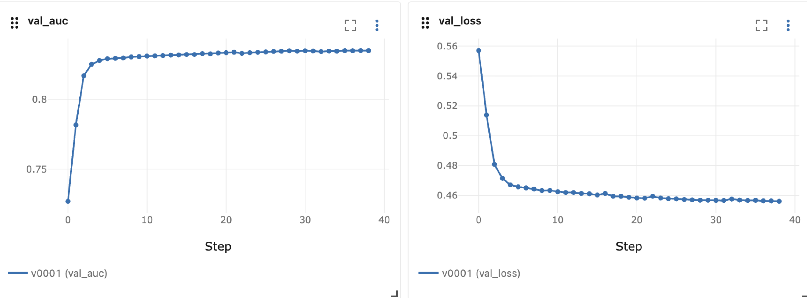
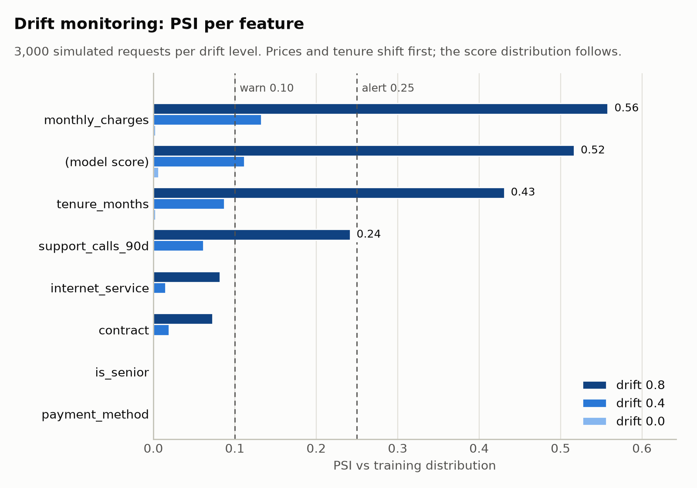
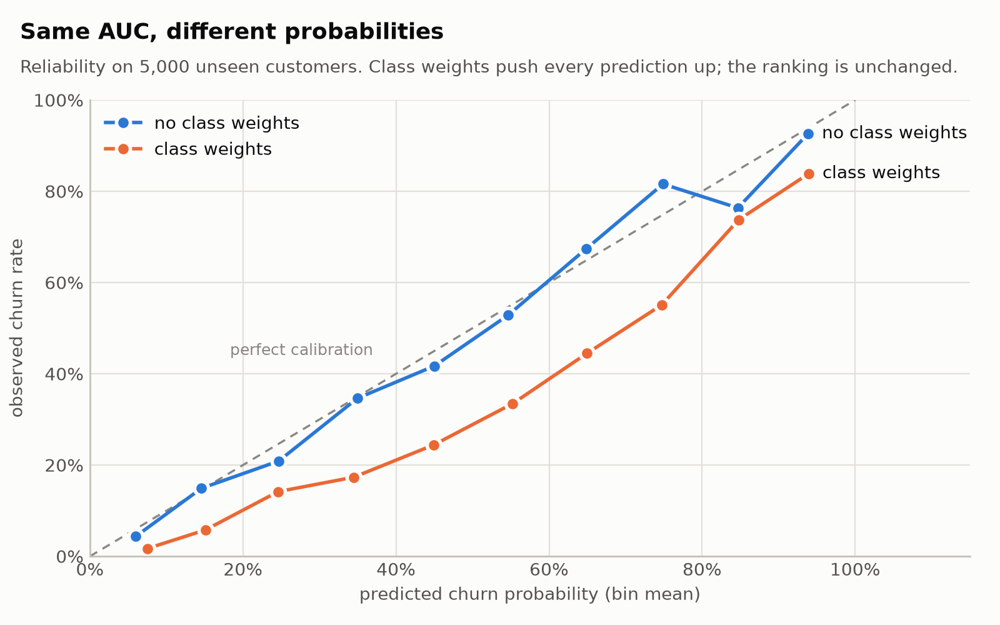

# keras-mlops-demo

**An end-to-end MLOps pipeline built around a small Keras 3 model:** data validation, experiment
tracking, an automated quality gate, a versioned model registry with rollback, a FastAPI service,
and drift monitoring. Once dependencies are installed, everything runs offline on a laptop CPU.

The model (customer churn prediction) is intentionally simple. The point of the project is the
machinery around it: the parts that decide whether a model is safe to ship and that notice when
it stops being safe.

```
generate ─► validate ─► split ─► train (Keras) ─► evaluate ─► bundle ─► QUALITY GATE ─► registry ─► API ─► monitor
                                    │                                       │                         │        │
                                 MLflow                              9 checks, exit 3          prediction    PSI-drift
                              (params, curves,                       blocks CI on failure        log           ALERT
                               metrics, artifacts)
```

## What this project demonstrates

| Concern | How it is handled | Where |
|---|---|---|
| Data quality | Schema, range, category and label-rate validation stop the pipeline before training | `data.py` |
| Lineage | Dataset fingerprint, config, library versions and MLflow run ID saved with every model | `train.py`, `metadata.json` |
| Training/serving | One preprocessing class for training and serving; normalization lives inside the model | `preprocessing.py`, `model.py` |
| Reproducibility | Seeded data, splits and weights; pinned dependencies in `uv.lock` | `train.py`, `uv.lock` |
| Experiment tracking | Params, per-epoch learning curves, test metrics and the full bundle logged to MLflow | `train.py` (`Tracker`) |
| Honest evaluation | Threshold picked on validation, metrics reported on test, compared against a baseline | `evaluation.py` |
| Release decision | 9-check quality gate incl. champion/challenger, slice AUC and calibration | `gate.py` |
| Deployment & rollback | Promotion and rollback move an atomic pointer | `registry.py` |
| Serving | Strict Pydantic contract (422 on bad input), OOV-safe categories, 503 without a model | `serve.py` |
| Monitoring | Prediction log + PSI on every feature and on the score distribution, with a small-sample guard | `drift.py`, `monitor.py` |


## Quick start

Requires Python ≥ 3.10 and [uv](https://docs.astral.sh/uv/).

```bash
uv sync --extra dev            # creates .venv with the locked versions
uv run make test               # 45 tests, ~15 s
uv run make train              # train + quality gate + promote to production
uv run make mlflow-ui          # http://localhost:5000
uv run make serve              # http://localhost:8000/docs
uv run make drift-alert        # simulate drifted traffic and watch the monitor fire
```

```bash
curl -X POST localhost:8000/predict -H 'content-type: application/json' -d '{
  "tenure_months": 3, "monthly_charges": 95.5, "support_calls_90d": 4, "is_senior": 0,
  "contract": "month_to_month", "payment_method": "e_check", "internet_service": "fiber"}'
```

```json
{"request_id": "948b…", "churn_probability": 0.993, "churn_predicted": true,
 "threshold": 0.407, "model_version": "v0001", "unknown_categories": []}
```

## The pipeline

### Data
Customers are generated synthetically (`generate_customers`), so the project needs no downloads and
the true label-generating mechanism is known. The mechanism deliberately includes interactions and
non-linearities (early-tenure churn, fiber price sensitivity, a U-shaped price effect) that a linear
model cannot capture. A `drift` parameter shifts both the feature distributions and the behaviour, which
lets the monitoring be tested against a known ground truth.

| Feature | Type | Example |
|---|---|---|
| `tenure_months` | int | 22 |
| `monthly_charges` | float | 39.66 |
| `support_calls_90d` | int | 0 |
| `is_senior` | 0/1 | 0 |
| `contract` | category | `one_year` |
| `payment_method` | category | `card` |
| `internet_service` | category | `dsl` |
| **`churn`** (label) | 0/1 | 0 |

### Model
A Functional-API network with four inputs: a `Normalization` layer (adapted on the training split only)
for numeric features, a small `Embedding` per categorical feature (index 0 reserved as an
out-of-vocabulary bucket), two ReLU layers with L2 and dropout, and a sigmoid output. 3,262 parameters,
trained with early stopping on validation PR-AUC.

Every epoch is logged to MLflow, so the learning curves of each version can be inspected and compared:



*MLflow UI, run v0001: validation AUC plateaus around epoch 10 and early stopping ends training after ~40 epochs.*

### Quality gate
The gate loads the bundle **back from disk** (so it tests exactly what would be deployed) and runs:

| Check | Question it answers |
|---|---|
| `min_auc` | Is the model good enough at all? |
| `calibration_in_the_large` | Does a "30%" prediction mean ~30% in reality? |
| `beats_baseline` | Does it beat a logistic regression? |
| `no_regression_vs_champion` | Is it no worse than production, **on the same test set**? |
| `slice_auc:*` (×3) | Does every customer segment get a usable model? |
| `serialization_roundtrip` | Does save → load change any prediction? |
| `latency_p95_ms` | Is single-row inference fast enough? |

Every result is written to `gate_report.json`. A failed gate exits with code **3**, which is what makes the
CI step blocking.

### Monitoring
The API appends every prediction to a JSONL log. `monitor.py` compares the most recent window against
reference distributions stored in the bundle at training time, using PSI per feature and on the score
distribution. Below 500 samples PSI is dominated by sampling noise, so no alert is raised. The monitor exits
with code **1** on an alert, so a scheduler can trigger retraining.

<picture>
  <source media="(prefers-color-scheme: dark)" srcset="docs/images/drift-psi-dark.png">
  
</picture>

## Results

| | v0001 (seed 42) | v0002 (seed 7) |
|---|---|---|
| Test ROC-AUC | **0.8248** | 0.8221 |
| Logistic-regression baseline | 0.8132 | 0.8131 |
| Test PR-AUC | 0.6834 | 0.6805 |
| Mean prediction vs observed churn | 0.311 vs 0.307 | 0.299 vs 0.303 |
| p95 latency, in-process / over HTTP | 4.4 ms / 6.5 ms | 3.4 ms / not measured |

**Drift monitoring** (3,000 simulated requests per level against v0002):

| Drift level | Max PSI | Status | AUC on true labels | Observed churn | Mean predicted |
|---|---|---|---|---|---|
| 0.0 | 0.007 | OK | 0.818 | 30.3% | 30.2% |
| 0.4 | 0.135 | WARN | 0.828 | 40.6% | 37.7% |
| 0.8 | 0.568 | ALERT | 0.840 | 52.7% | 47.6% |

## Findings

These came up while building the project and shaped the design.

**1. The network first lost to logistic regression.** On an earlier, nearly linear version of the data the
network scored AUC 0.8274 against a baseline of 0.8283, and the gate rejected it. Rather than loosen the
threshold, I made the synthetic mechanism genuinely non-linear. The `beats_baseline` check exists to catch
exactly this: on simple data a simple model is enough, and the extra complexity is not worth running.

**2. Same AUC, broken probabilities: class weights.** Training with balanced class weights left AUC unchanged
(0.8244 vs 0.8248), yet the gate rejected the model. Comparing both models on 5,000 fresh customers
(`scripts/compare_calibration.py`):

| | No weights | Class weights |
|---|---|---|
| Mean prediction (observed: 0.303) | 0.313 | **0.445** |
| Rank correlation between the two models | 0.998 | |
| Decision agreement, each at its own threshold | 97.8% | |
| Brier score (lower is better) | 0.151 | 0.172 |

<picture>
  <source media="(prefers-color-scheme: dark)" srcset="docs/images/calibration-dark.png">
  
</picture>

<details>
<summary>Reliability in numbers</summary>

| Model says… | 0–20% | 20–40% | 40–60% | 60–80% | 80–100% |
|---|---|---|---|---|---|
| …observed churn, no weights | 9% | 27% | 47% | 73% | 82% |
| …observed churn, class weights | 5% | 15% | 30% | 50% | 77% |

</details>

The weights multiply every customer's odds by roughly the same factor (~2.3). The ranking is preserved, so
AUC cannot see the problem, and the validation-picked threshold absorbs the shift, so the yes/no decisions
barely change. But the API returns a field called `churn_probability`. Anyone summing it to forecast churn
would over-forecast by about 45%. AUC alone was not a sufficient release criterion, which is why the gate
now includes `calibration_in_the_large`.

**3. Drift does not necessarily mean the model got worse.** In the simulation, AUC actually rose under drift,
while the churn rate and the feature distributions shifted substantially. A PSI alert means "investigate",
not "the model is broken". That is why the monitor recommends checking the data source before retraining.

**4. Reproducibility is per-platform.** With an identical dataset fingerprint, the same seed gave test AUC 0.8248
on Linux x86 and 0.8245 on Apple Silicon: floating-point operations run in a different order on different
hardware. Model comparisons therefore use tolerances, never exact equality.

**5. Tolerance is a policy decision.** v0002 was 0.0006 AUC below the champion on the same test set and was
still promoted, because `max_regression = 0.005` treats that gap as noise at 4,000 test rows. A stricter
"only strictly better" policy is a one-line config change, with the trade-off of blocking routine refreshes on noise.

## Reproducing the experiments

```bash
# Champion vs challenger
uv run python -m mlops_demo.train --promote --seed 7
cat artifacts/models/v0002/gate_report.json
uv run make registry && uv run make rollback

# Class weights vs calibration (Finding 2)
uv run python -m mlops_demo.train --no-mlflow --artifacts exp/no_weights
uv run python -m mlops_demo.train --no-mlflow --artifacts exp/class_weights --class-weights   # exits 3
uv run python scripts/compare_calibration.py exp/no_weights exp/class_weights

# A deliberately weak model: four checks fail, exit code 3
uv run python -m mlops_demo.train --rows 1500 --epochs 2 --no-mlflow --artifacts exp/weak

# Regenerate the README figures (light + dark), ~25 s
uv sync --extra dev --extra figures
uv run make figures
```

The figures are produced by code from the same pipeline, so they are reproducible rather than hand-made.
The drift figure uses the default-seed model, so its PSI values differ slightly from the table above (v0002).
Colors come from a palette validated for colorblind safety in both light and dark mode.

## Project layout

```
src/mlops_demo/
  config.py          schema, hyperparameters, gate thresholds (single source of truth)
  data.py            synthetic generator, validation, fingerprint
  preprocessing.py   shared train/serve preprocessing, OOV handling
  model.py           Keras Functional-API model
  evaluation.py      metrics, threshold selection, slice AUC, baseline
  predictor.py       self-contained model bundle + Predictor
  registry.py        versioned bundles, atomic promote/rollback
  gate.py            quality gate
  train.py           the training pipeline (orchestrates everything above)
  serve.py           FastAPI service + prediction log
  drift.py           PSI computation
  monitor.py         drift report from the prediction log
  simulate.py        traffic simulator
scripts/
  compare_calibration.py   class-weights experiment (Finding 2)
  make_figures.py          regenerates docs/images
docs/images/         README figures
tests/               45 tests: data, model, drift, gate, registry, API
Makefile  pyproject.toml  uv.lock
```
