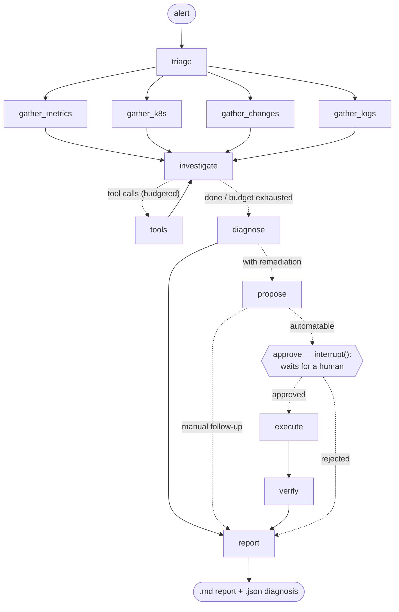
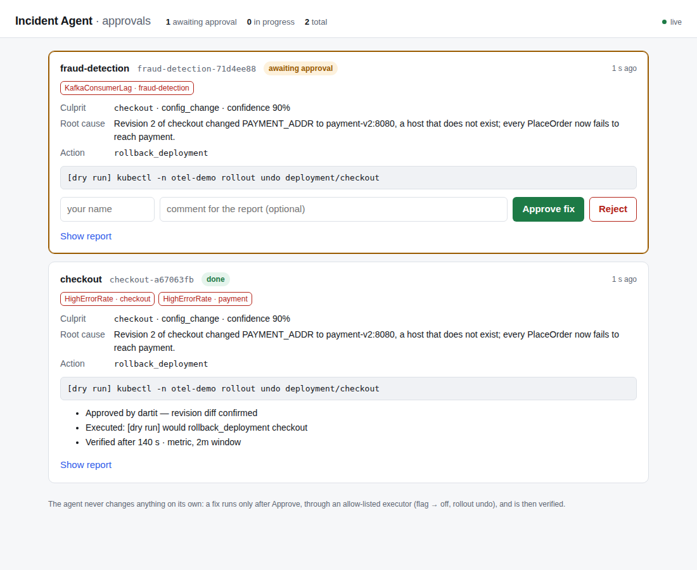
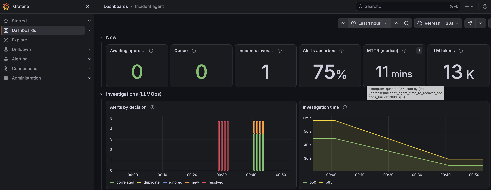
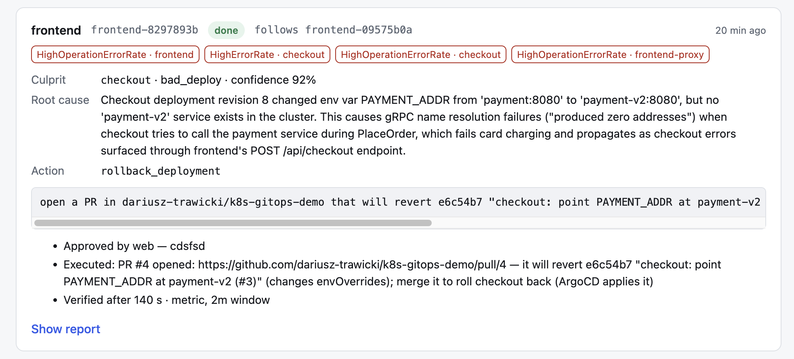

# k8s-incident-agent

An SRE agent built on **LangGraph** that diagnoses incidents in Kubernetes.
It takes an alert from Prometheus, collects metrics, pod state, rollout history, feature
flags and logs, runs an investigation and returns a **structured diagnosis**:
the culprit service, the root-cause category, the evidence and a recommended action.

The agent is tested on a realistic microservice shop
([OpenTelemetry Demo](https://opentelemetry.io/docs/demo/)) with **12 injected faults
that have ground truth**, so its accuracy can be measured rather than just shown in a demo.

## Graph architecture



| Decision | Why |
|---|---|
| Evidence collected **by code, in parallel** (4 branches, a state reducer) | Cheap and deterministic. The LLM gets it up front and does not spend tokens on obvious queries. |
| **ReAct loop with a hard tool-call budget** | The agent cannot loop forever or burn through the budget. When the limit is hit it still returns a diagnosis, flagged as incomplete. |
| **Read-only tools only** | No tool changes cluster state. Remediation is a separate node behind `interrupt()` (human approval), not a tool the model can call on its own. |
| **Structured output** (`Diagnosis`, category and action enums) | Diagnoses can be scored automatically against ground truth. |
| Rollout history with a **diff** (image, env, limits) | "What changed?" is the first question an SRE asks. The agent sees that revision 2 changed `PAYMENT_ADDR`. |
| **Checkpoints + incident list in one database** (SQLite locally, Postgres in the cluster) | State is saved after every node. An investigation survives a crash, and an incident waiting for approval survives a restart of the agent. |
| **Alert prioritisation** (critical > warning, earliest first) | Something is always firing in the background. The agent picks the alert most likely closest to the root cause. |
| Configurable model (`provider:model`) | The model is a setting, not code, so another model can be tried without changing the agent. |
| **The LLM proposes, plain code executes** (`interrupt()` + an allow-listed executor) | The model never gets a write tool. A fix runs only after a human approves it, through code that knows exactly two reversible actions. |

## First result on a live cluster

Injected flag `paymentFailure` (50% of card charges fail); the agent started from an alert on
**checkout**, which is only a victim of the fault:

| | Expected | Agent |
|---|---|---|
| Culprit | `payment` | `payment` ✓ |
| Category | `feature_flag` | `feature_flag` ✓ |
| Action | disable the flag | disable the flag → `paymentFailure` ✓ |
| Cost | | 2 extra tool calls, 3 LLM calls, ~13k tokens |

## Evaluation

```bash
incident-agent eval run                           # all 12 scenarios, 1 run each
incident-agent eval run -s payment-failure -n 3   # one scenario, 3 repetitions (the LLM is non-deterministic)
incident-agent eval report reports/eval/<ts>/results.json
```

Each run: reset → wait until no alert has fired for 5 min → inject → wait for the alert →
investigation → score `culprit_service`, `category` and `recommended_action` against `expected` from
`scenarios/scenarios.yaml` → reset. Runs without a verdict (no alert fired, the cluster never got quiet,
the agent crashed) count as misses. Results go to `reports/eval/<timestamp>/` (`results.json`,
`results.md` and the report of every run).

### Results (Claude Sonnet 5, 1 run per scenario)

| Scenario | Alert · service | Culprit | Category | Action | Time to alert | Investigation | Tool calls | Tokens |
|---|---|---|---|---|---|---|---|---|
| `payment-failure` | HighErrorRate · checkout | ✓ | ✓ | ✓ | 301 s | 32 s | 2 | 13,976 |
| `payment-unreachable-flag` | HighErrorRate · checkout | ✓ | ✓ | ✓ | 240 s | 27 s | 2 | 13,373 |
| `payment-unreachable-deploy` | HighErrorRate · checkout | ✓ | ✓ | ✓ | 300 s | 28 s | 5 | 23,861 |
| `recommendation-memory-leak` | recommendation | ✓ | ✓ | ✓ | 150 s | 27 s | 2 | 14,179 |
| `email-memory-leak` | email | ✓ | ✓ | ✓ | 360 s | 19 s | 0 | 8,156 |
| `bad-image` | ContainerNotReady · product-catalog | ✓ | ✓ | ✓ | 195 s | 24 s | 0 | 11,763 |
| `cart-failure` ² | HighOperationErrorRate · cart | ✓ | ✓ | ✓ | 345 s | 24 s | 3 | 12,953 |
| `product-catalog-failure` ⁴ | HighOperationErrorRate · product-catalog | ✓ | ✓ | ✓ | 346 s | 24 s | 2 | 12,334 |
| `ad-high-cpu` ² | HighCpuUsage · ad | ✓ | ✓ | ✓ | 345 s | 25 s | 0 | 7,507 |
| `kafka-lag` ³ | KafkaConsumerLag · fraud-detection | ✓ | ✓ | ✓ | 225 s | 29 s | 2 | 13,346 |
| `cart-not-ready` ³ | ContainerNotReady · cart | ✓ | ✓ | ✓ | 241 s | 26 s | 0 | 8,790 |
| `currency-oom` ⁵ | PodRestarting · currency | ✓ | ✓ | ✓ | 45 s | 33 s | 1 | 18,417 |

² second run, after adding the missing alert rules. ³ third run (fixes in `chaos`, the probe, the Kafka alert). ⁴ after fixing the flag tool (before: escalate, 8–12 tool calls, 44–61k tokens, 75–82 s). ⁵ after fixing the scenario (a 2Mi limit instead of 6Mi).

**Result: 12/12 scenarios** — correct culprit, category and action in every one.
Investigation: **26 s** on average (max 33 s), **1.6 tool calls** (zero in 4 scenarios — the
automatically collected evidence was enough), **~13k tokens** (max 24k).

We got to 12/12 over several runs, and that is the most interesting part: **not a single miss along
the way was a reasoning error by the model.** One looked like an agent error and turned out to be a
bug in its tool; the rest were gaps in the lab — missing alerts, scenarios that broke nothing, and
noise that blocked the evaluation.

#### An agent miss that turned out to be a tool miss

In `product-catalog-failure` the flag tool queried flagd over OFREP without any context, but the flag
is enabled for a single product only — so it looked disabled. The agent checked rollouts,
dependencies, resources and logs, found nothing, reported 35% confidence and escalated to a human
instead of guessing. Good behaviour given a bad tool. The fix: read the flag definitions, including
targeting rules, from flagd-ui (`GET /api/read`), with OFREP kept as a fallback that warns. The first
version of the fix **did not work** (the agent still "could not see" the flag): flagd-ui reads its file
only at start-up, and `chaos` was writing the file via `kubectl exec`, bypassing its API — flagd saw the
fault, flagd-ui did not. `chaos` now writes flags through `POST /api/write`, just like the browser does.
After the fix: a correct diagnosis in **2 tool calls, 12k tokens and 24 s** — instead of 8–12 tool
calls, 44–61k tokens, ~80 s and an escalation. Takeaway: an agent is largely as good as its tools —
and as consistent as the sources they read from.

#### Gaps in the lab

In the first run, 6 scenarios produced no alert at all:

- `cart-failure` — errors in a single operation (EmptyCart) were lost in the service-wide average (<5%).
  Added a per-`span_name` `HighOperationErrorRate` alert → correct in the second run.
- `product-catalog-failure` — **the inject was a no-op**: the flag has a targeting rule (product
  OLJCESPC7Z only), so `defaultVariant` changes nothing. `chaos` now switches the `targeting.if` branch, like flagd-ui.
- `ad-high-cpu` — there was no CPU rule at all. Added `HighCpuUsage` (cAdvisor, >0.5 cores) → correct.
- `cart-not-ready` — the chart defines no readiness probe for cart, so the flag had no effect in
  Kubernetes. The chart schema only allows `httpGet`, and cart speaks HTTP/2 (gRPC) only, so a
  gRPC probe is added by the patch `infra/cart-readiness-probe.yaml` (`make probes`, also in `chaos reset`).
- `kafka-lag` — fraud-detection sleeps 1 s per message while checkout sends 100 extra messages per order;
  the queue grew, but no alert measured the lag. Added `KafkaConsumerLag`
  (`kafka_consumer_group_lag` from the broker, >100 messages). After ~15 min the fraud-detection JVM's
  memory also ballooned and blocked the following scenarios → limit 300Mi → 500Mi.
- `currency-oom` — **the scenario broke nothing**: a 6Mi limit, while currency (C++) peaks at ~4.7 MiB,
  so it kept running at 78% of the limit. No alert was the correct outcome. The scenario limit was
  measured and lowered to 2Mi. Takeaway: verify the injected fault before judging the monitoring or the agent.

Takeaway: evaluating an SRE agent is also an audit of your monitoring. Half of the "misses" pointed at missing alerts.

## Quick start without a cluster (2 minutes)

```bash
make install && source .venv/bin/activate
make test                          # 178 tests: graph, budget, checkpoints, resume, chaos, eval, logs, webhook, remediation
cp .env.example .env               # set AGENT_MODEL and the API key
set -a; source .env; set +a
incident-agent investigate --backend fake \
  --fixture tests/fixtures/payment-unreachable-deploy.json
```

`fake` mode replays recorded cluster data, but the LLM is real.
The scenario is a trap: the symptom (checkout cannot reach payment) looks exactly like the
`paymentUnreachable` flag, but the flags are clean and the cause is a fresh deploy with a bad
`PAYMENT_ADDR`.

## Full lab on kind

Requirements: Docker (at least **8 GB RAM**), `kind`, `kubectl`, `helm`, Python 3.11+.

```bash
make up              # kind cluster + OTel Demo + alert rules + Alertmanager (~10 min)
make port-forward    # shop :8080, Prometheus :9090, Alertmanager :9093, OpenSearch :9200, flagd :8016
incident-agent doctor                        # can the agent reach every data source?

incident-agent chaos list                    # 12 scenarios with ground truth
incident-agent chaos inject payment-failure  # inject a fault
incident-agent alerts                        # after 2-4 min the alert should be "firing"
incident-agent investigate --from-prometheus --service checkout
incident-agent chaos reset                   # flags -> off, deployments -> helm state
```

Reports go to `reports/` as `.md` (for humans) and `.json` (for evaluation).
If an investigation is interrupted (e.g. a model API error), the CLI prints
`incident-agent investigate --resume <thread-id>`, which resumes from the last checkpoint
without collecting the evidence again.

After changing `infra/otel-demo-values.yaml` on a running cluster: `make apply-values`
(then wait ~10 min before an evaluation: Prometheus restarts with an empty history).

## Webhook: the agent reacts on its own

Instead of running `investigate` by hand, the agent can act like a real on-call engineer:
Alertmanager sends alerts to a webhook, and the agent investigates every new incident by itself.

```
Alertmanager --POST /alertmanager--> FastAPI --> incident registry --new--> queue --> worker --> LangGraph graph
                                                 (dedup, correlation)                              │
                                                                                 .md/.json report + /metrics
```

```bash
make apply-values     # (only on a cluster created before this step) Alertmanager + restarts Prometheus and Alertmanager
make port-forward
make serve            # incident-agent serve, port 8787 (do not run together with `eval run`)
incident-agent chaos inject payment-failure
make incidents        # list of incidents once the alert fires
```

Without a cluster and at zero LLM cost: `make serve-dry` in one terminal and `make fire-test` in
another (it sends a sample Alertmanager payload; a second call shows deduplication).

**Deduplication and correlation** (`incidents.py`) — one fault usually fires several alerts at once,
and Alertmanager repeats notifications. Every alert gets a decision:

| Decision | Meaning |
|---|---|
| `new` | a new incident, goes to the queue |
| `duplicate` | the same alert (fingerprint) in an open incident |
| `correlated` | another alert of the same service or of a dependency-map neighbour (e.g. `payment` during a `checkout` incident) |
| `resolved` / `ignored` | the alert resolved / no `service` label |

An incident stays open while any of its alerts is firing, plus `DEDUP_WINDOW_MINUTES`
(30 by default) after the last one resolves, so a flapping alert does not keep opening new incidents.
If all alerts resolve before the worker picks the incident up, the investigation is skipped (`skipped`).

**A queue and a single worker** — an investigation takes tens of seconds, while Alertmanager expects a
fast response. The endpoint only registers the alert and returns 200; the investigation runs in the
background, one incident at a time (LLM cost control). `thread_id` = incident id, so a failed
investigation can be resumed with `incident-agent investigate --resume <incident-id>`.

**Endpoints:** `POST /alertmanager`, `GET /incidents`, `GET /incidents/{id}` (with the report), `GET /healthz`,
`GET /metrics`. With `WEBHOOK_TOKEN` set, the webhook and the incident list require
`Authorization: Bearer <token>` (in Alertmanager: `http_config.authorization` under `webhook_configs`).

**Agent metrics** (`/metrics`, LLMOps): `incident_agent_alerts_received_total{decision}`,
`incident_agent_investigations_total{status}`, `incident_agent_investigation_duration_seconds`,
`incident_agent_llm_tokens_total{direction}`, `incident_agent_llm_calls_total`,
`incident_agent_tool_calls_total`, `incident_agent_queue_depth`.

**Tracing** (optional, `tracing.py`) — LangSmith is enabled purely through environment variables
(`LANGSMITH_TRACING=true`, `LANGSMITH_API_KEY`); Langfuse via `pip install -e ".[tracing]"` and
`LANGFUSE_PUBLIC_KEY` / `LANGFUSE_SECRET_KEY`. Traces carry a name, tags (`webhook` / `cli` / `eval`)
and metadata (alert, service); a missing package or a tracing error never interrupts an investigation.

## Human-approved remediation

After the diagnosis the agent can **propose** a fix. It never applies one on its own: the graph pauses
with LangGraph's `interrupt()`, the state waits in the checkpoint (minutes or hours), and only a human
decision resumes it. There is deliberately no auto-approve option.

| Who | Does what |
|---|---|
| LLM | recommends an action and a target inside the structured `Diagnosis` |
| `remediation.propose()` | checks it against the allow-list and confidence (≥ 60%), and writes out the exact command |
| **a human** | the approval page at `http://localhost:8787/`, or `incident-agent approve <id>` / `reject <id>` |
| executor (plain code) | re-validates and runs one of **two reversible actions**: flag → `off` via the flagd-ui API, or `kubectl rollout undo` |
| verifier | a fast probe (the alert's own signal over a 2m window, 3 healthy readings in a row) or the alert clearing; after 15 min without recovery it asks to escalate |

Everything else (`increase_resources`, `restart_pods`, `scale_up`, `escalate_to_human`) is reported as a
manual follow-up. A rollback may only target application services from the dependency map (never
Prometheus or Grafana) and only if a previous revision exists.

```bash
make serve                                   # fixes: live, human approval required
incident-agent chaos inject payment-failure
open http://localhost:8787/                  # after ~5 min: the incident, the diagnosis and the exact command
# click "Approve fix" — or: incident-agent approve checkout-1a2b3c4d --comment "flag confirmed"
```



The page is one self-contained HTML file served by the agent (no build step, no external assets). It polls
`/incidents`, and the decision goes through the same API as the CLI. Agent and LLM text is inserted as
text only (never as HTML), the page cannot be framed, and approve/reject accept **JSON only** — a
malicious page open in the same browser can send a plain form to `localhost`, but not cross-origin JSON,
so it cannot forge an approval. With `WEBHOOK_TOKEN` set, the page asks for the token.

**First live run** (`payment-failure`, Claude Sonnet 5): diagnosis and proposal in 43 s, human approval after
7 min, flag turned off, all 4 alerts cleared — verified after 601 s by waiting for the alert. That wait is
the alert rule's own inertia (5m window + `keep_firing_for: 5m`, there to stop flapping), not a slow fix —
which is why the verifier now also asks the same question over a 2-minute window.

Without the server: `incident-agent investigate --from-prometheus --service checkout --remediate`
shows the proposal in the terminal and asks `Approve this fix? [y/N]`. `--fixes dry-run` (and any
`--backend fake` run) only records what it would do.

New metrics: `incident_agent_remediations_total{action,outcome}` (proposed, approved, rejected, executed,
failed, recovered, not_recovered, not_automated), `incident_agent_awaiting_approval`,
`incident_agent_approval_wait_seconds`, and `incident_agent_time_to_recover_seconds` — **MTTR**, from the
first alert to a verified fix.

Note: verification runs on the single worker, so while it waits (typically 2–3 min with the fast probe,
up to 15 min) new incidents queue up behind it. Fine for a lab; a production setup would verify asynchronously.

## The agent in the cluster

```
otel-demo namespace                                  incident-agent namespace (Pod Security: restricted)
┌───────────────────────────────┐   POST + Bearer    ┌──────────────────────────────────────────────┐
│ Alertmanager ─────────────────┼───────────────────▶│ incident-agent  (1 replica, Recreate)        │
│ Prometheus ◀── scrape /metrics┼────────────────────│   webhook · approval page · /metrics         │
│ Grafana: "Incident agent"     │                    │   ServiceAccount: read + patch app deploys   │
│ checkout, payment, ...  ◀─────┼── rollout undo ────│        │                                     │
│ flagd-ui API  ◀───────────────┼── flag -> off ─────│        ▼                                     │
└───────────────────────────────┘  (after approval)  │ postgres (StatefulSet + PVC)                 │
                                                     │   LangGraph checkpoints + incidents table    │
                                                     └──────────────────────────────────────────────┘
```

```bash
set -a; source .env; set +a      # ANTHROPIC_API_KEY (and optionally AGENT_MODEL / AGENT_LANGUAGE)
make agent-up                    # image -> kind, Secrets, Postgres, RBAC, agent, dashboard, Alertmanager route
make agent-doctor                # data sources, Postgres and RBAC checked from inside the pod
make agent-pf                    # approval page on http://localhost:8787/  (token: make agent-token)
make agent-route-host            # alerts back to `make serve` on the laptop (make agent-route = to the cluster)
```

| Decision | Why |
|---|---|
| **State outside the pod** (`PostgresSaver` + an `incidents` table in the same database, on a PVC) | A pod can be killed or rescheduled at any time. An incident paused at `awaiting_approval` must still be there, and approvable, after a restart — `make agent-restart` demonstrates it. |
| **Restart policy per status** | `queued` → queued again; `investigating` → continued from the last checkpoint (read-only, so safe — the evidence is not gathered twice); `awaiting_approval` → unchanged; `remediating` → **failed, never retried**: the fix may already have run, and repeating `rollout undo` would roll back one revision too far. |
| **Least-privilege ServiceAccount** | Read pods, events, deployments, replicasets. The only write is `patch` on the application deployments, listed by name (`resourceNames`, kept equal to the dependency map by a test). No secrets, no `exec`, no delete. `incident-agent doctor` asks the API server (`kubectl auth can-i`) and fails if the account can do more — or less. |
| **Exactly one replica, `Recreate`** | One worker owns the queue. Two agents would both receive every alert and pay for every investigation twice. |
| **Hardened pod** | Non-root, read-only root filesystem, no capabilities, seccomp `RuntimeDefault`; the namespace enforces Pod Security `restricted`. |
| **Secrets never in git or helm values** | The API key, the webhook token and the Postgres password are Kubernetes Secrets created by `make agent-secrets`. Alertmanager reads the token from a mounted file (`credentials_file`). |
| **Its own namespace** | `chaos reset` re-applies the demo's helm manifest and never touches the agent; a broken demo cannot take the agent's database with it. |
| **Metrics scraped by the lab's Prometheus** | Pod annotations, no extra config. The **Incident agent** dashboard (Grafana) shows awaiting approvals, the share of alerts absorbed by dedup, tokens per investigation, investigation time, remediation outcomes and MTTR. |

**Live run in the cluster** (`payment-failure`, Claude Sonnet 5): the incident reached `awaiting_approval`,
then the agent pod was deleted (`make agent-restart`). The new pod loaded the incident from Postgres
(`recovered after restart: awaiting=1`), the approval page showed the same proposal, and after **Approve** the
in-cluster agent turned the flag off through its narrow permissions and verified recovery **140 s** later.
`incident-agent doctor`, run inside the pod, confirms Postgres and that the ServiceAccount can do exactly what it
should — no more, no less.



*The "Incident agent" dashboard after a live `payment-failure` run: one investigation for four alerts
(75% absorbed by correlation), ~13k tokens, MTTR 11 min from the first alert to a verified fix.*

Locally nothing changes: `make serve` keeps using `.data/checkpoints.sqlite` (and now also keeps its incident
list there). Point `CHECKPOINT_DB` at a `postgresql://` URL to use Postgres from the laptop too.

## Rollback as a pull request, applied by ArgoCD

With ArgoCD the Git repository is the source of truth, so `kubectl rollout undo` is the wrong tool: it is drift
the next sync can silently undo, and it leaves no review trail. In GitOps mode the agent's rollback is a **pull
request** in a separate repository (`k8s-gitops-demo`) that holds the Helm values ArgoCD deploys:

```
Approve on the page (human #1) -> agent opens a PR -> a human merges it (human #2) -> ArgoCD syncs -> verifier
```

- **What the PR contains.** The agent finds the most recent commit that changed `components.<service>` in
  `values/otel-demo.yaml` and restores that section to its state before the commit. One mechanism covers a bad
  image tag, a bad env var (`envOverrides`) and a bad resource limit; unrelated newer changes stay.
- **The human sees the commit before approving.** The proposal on the approval page reads *"open a PR in
  owner/repo that will revert `3fa9c1e` "checkout: point PAYMENT_ADDR at payment-v2" (changes envOverrides)"*.
- **Drift is not a Git problem.** If Git shows no change to the service (e.g. the lab's `kubectl set env`
  scenarios), a PR cannot fix it, so the proposal is *not automated* and the report says why. The eval harness
  keeps using the default `kubectl` mode for that reason.
- **Least privilege.** The token is a fine-grained PAT limited to one repo (Contents + Pull requests). The code
  writes only to branches `incident-agent/revert-*`, never to the base branch, and `main` should require a PR.
  The cluster ServiceAccount needs nothing new (reads only; GitOps mode never patches).
- **Idempotent.** A second approval reuses the open PR (branch name = service + culprit commit).
- **Flag fixes stay runtime.** Feature flags are not Git state, so `disable_feature_flag` still goes through flagd-ui.

```bash
# one-time: an EMPTY public GitHub repo, cloned next to this one
make gitops-bootstrap GITOPS_REPO=<owner>/k8s-gitops-demo   # values (+ Alertmanager overlay) and the ArgoCD Application
cd ../k8s-gitops-demo && git add -A && git commit -m init && git push   # then protect main: require a pull request
cd -  && make gitops-up                                      # ArgoCD (core, ~lighter) adopts the otel-demo release
GITOPS_TOKEN=<PAT> make agent-gitops GITOPS_REPO=<owner>/k8s-gitops-demo   # agent -> rollback PRs; doctor confirms access

make gitops-break                                            # a bad PAYMENT_ADDR, merged through a PR (needs gh)
# ~5 min: the alert fires, the card appears -> Approve -> the agent opens "rollback(checkout): revert ..." -> merge it
make agent-kubectl-rollback                                  # back to `kubectl rollout undo`
```

After `make gitops-up` the release belongs to ArgoCD: `make apply-values` refuses to run (helm would fight it);
change values through Git. `make gitops-down` hands the release back (objects stay). `prune` and `selfHeal` are
off in the lab because the chaos tooling and `make probes` change live objects; the cart readiness probe is listed
under `ignoreDifferences`.

Known simplifications: the verifier waits for the merge (default 30 min, `GITOPS_MERGE_TIMEOUT_MIN`) and then for
recovery (15 min) on the single worker, so a slow human blocks the queue — in production the wait would be
asynchronous. A restart while waiting marks the incident `failed` (never retried), but the PR stays open and can still be merged.

**Live run** (kind cluster, ArgoCD 3.5.3, Claude Sonnet 5): the bad change reached the cluster as a merged PR
(`checkout` `PAYMENT_ADDR` → `payment-v2:8080`), the agent named `checkout` as the culprit (`bad_deploy`, confidence 92%),
proposed reverting that exact commit and, after a human clicked *Approve fix*, opened a PR with a three-line diff.
The PR link appeared on the card straight away, a human merged it, ArgoCD applied it, and the verifier confirmed
recovery 140 s after the merge. `PAYMENT_ADDR` was back to `payment:8080` and the Application `Synced` / `Healthy`.
Two human gates: approving the fix, then merging the PR.



## Fault scenarios

| Type | Scenarios |
|---|---|
| OTel Demo feature flags | payment/cart/product-catalog errors, memory leaks (recommendation, email), CPU (ad), Kafka lag, a failing readiness probe |
| Kubernetes changes | bad image (ImagePullBackOff), bad env in a deploy, memory limit too low (OOMKilled) |

The full list with the expected culprit, category and action: [`scenarios/scenarios.yaml`](scenarios/scenarios.yaml).

## Layout

```
Dockerfile             the agent image (non-root, kubectl for rollout undo)
deploy/k8s/            namespace, RBAC, Postgres, the agent (Deployment, Service, ConfigMap)
deploy/gitops/         the ArgoCD `default` project (core install does not create it)
# the GitOps repository (values + ArgoCD Application) is generated into ../k8s-gitops-demo by `make gitops-bootstrap`
deploy/grafana/        the "Incident agent" dashboard
infra/                 kind, helm values (alert rules, Alertmanager + in-cluster route overlay), cart probe patch
scenarios/             fault catalogue + ground truth
src/incident_agent/
  graph.py             the LangGraph graph
  state.py             state, Alert, Diagnosis (category and action enums)
  tools.py             read-only tools for the LLM
  alerts.py            alert prioritisation
  alertmanager.py      Alertmanager webhook payload parsing (v4)
  incidents.py         incident registry: dedup, correlation, window, lifecycle
  server.py            FastAPI webhook, queue + worker, Prometheus metrics
  tracing.py           run config: thread_id, tags, Langfuse / LangSmith
  remediation.py       proposal, allow-listed executor (flag off / rollout undo), recovery verification (fast probe)
  gitops.py            rollback as a PR (revert the last change to a service's values), merge wait, repo bootstrap
  ui.py                the approval page served at GET /
  checkpointing.py     SQLite or Postgres checkpointer with a type allow-list
  store.py             the incident list in the same database (survives restarts)
  doctor.py            environment diagnostics (+ Postgres and RBAC when run in the cluster)
  eval.py              evaluation harness: inject, wait for the alert, score, table
  report.py            report rendering (en / pl)
  logs.py              log compaction (relevant fields only, duplicate collapsing)
  backends/live.py     Kubernetes API, Prometheus, OpenSearch, flagd (flagd-ui definitions + OFREP)
  backends/fake.py     replays recorded data (tests, demo)
  chaos.py             fault injection and reset
  cli.py               incident-agent investigate | serve | approve | reject | alerts | doctor | chaos | eval | graph | gitops-bootstrap | gitops-break
tests/                 tests without a cluster and without an LLM (scripted model)
```
