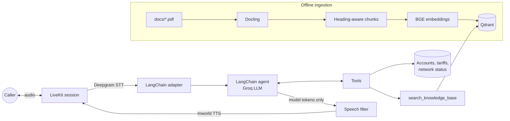

# Voice Customer-Support Agent 

A real-time voice assistant for **Kestrel Energy**, a fictional electricity supplier in Yorkshire, UK.
Callers speak naturally and the agent checks their balance, takes meter readings, reports power
cuts, works out which tariff would be cheapest for them, answers policy questions from PDF
documentation (RAG) and hands complex cases to a human team.

**Stack:** LiveKit Agents (real-time voice) · LangChain agent on Groq · Docling (PDF parsing) ·
Qdrant + BGE embeddings (retrieval) · Deepgram Nova-3 (STT) · Inworld TTS

> All company, customer, pricing and outage data is fictional.

---

## Architecture



## What the agent can do

| Tool | Behaviour |
|---|---|
| `search_knowledge_base` | Semantic search over the billing FAQ, tariff guide and power-cut guide, with a relevance threshold so weak matches are dropped instead of hallucinated on |
| `get_account_summary` | Balance (owed / in credit / overdue), due date, tariff, latest reading, average usage |
| `submit_meter_reading` | Validates readings: rejects values below the last reading, flags implausible jumps relative to typical usage, and skips smart-meter customers |
| `check_power_cuts` | Current faults and planned work by town; points callers outside the area to the national 105 line |
| `compare_tariffs` | Calculates the yearly cost of every tariff from usage and time-of-day split, ranks them, and prices the green premium |
| `get_tariff_details` | Rates, off-peak hours, standing charge and perks; understands short names like "E7" or "the green one" |
| `create_support_ticket` | Opens a ticket for the human team and returns a reference the agent spells out letter by letter |

## Design decisions

- **Voice-first tool output.** Every tool returns one or two speakable sentences – "£86.40, due on
  20 October 2026" rather than JSON – so the LLM can relay results without reformatting, and the
  system prompt keeps replies to one to three sentences.
- **Speech-to-text tolerant inputs.** Account numbers are normalised from forms like "70 01 23 45"
  or "7001-2345", and towns from "in Hull" or "Kingston upon Hull".
- **No tool output in the caller's ear.** LiveKit's LangChain adapter would speak raw `ToolMessage`
  content. [`voice_agent/speech_filter.py`](voice_agent/speech_filter.py) uses an allow-list, so
  only model-generated tokens reach TTS.
- **Single source of truth.** Tariffs live in [`energy_agent/catalog.py`](energy_agent/catalog.py), and
  [`scripts/build_docs.py`](scripts/build_docs.py) generates the PDFs from it. The prices the agent
  quotes from its tools can't drift from the prices it retrieves from documents.
- **Process-safe resources.** LiveKit runs each call in a separate worker process. The embedding
  model is pre-loaded per worker, and Qdrant is opened lazily on first use, so the parent process
  never holds the embedded database's file lock.
- **Idempotent ingestion.** Chunks get deterministic UUIDv5 IDs, and every chunk carries its source
  file and heading breadcrumb for better retrieval and traceable answers.
- **Safety and privacy guardrails in the prompt.** The agent only ever asks for an account number,
  never invents prices or outage details, and gives emergency guidance (999 / 105) when a caller
  describes danger.

## Quick start

Requirements: Python 3.12+, a [LiveKit Cloud](https://livekit.io/) project and a [Groq](https://console.groq.com/keys) API key.

```bash
uv sync                       # or: pip install -e ".[dev]"
cp .env.example .env          # add your keys
source .venv/bin/activate

python ingest.py              # index docs/*.pdf (downloads models on first run)
python -m voice_agent.main console   # talk to it through your mic and speakers
```

Chat with the same agent in text, with tool calls shown as they happen:

```bash
python -m energy_agent.chat
## Output:
# you > My account number is 70012345 – how much do I owe?
#   ↳ get_account_summary({'account_number': '70012345'})
# agent > You owe £86.40, due on 20 October 2026, ...

python -m energy_agent.rag "How do I submit a meter reading?"   # retrieval + answer only
## Output:
# ANSWER:
# You can submit a meter reading in the Kestrel app, through the voice assistant, or by texting READ <account number> <reading> to 60040 within the last 5 days of your billing month, using only whole numbers.
# SOURCES:
#   - kestrel-billing-and-payments.pdf (similarity 0.781)
#   - kestrel-billing-and-payments.pdf (similarity 0.756)
#   - kestrel-billing-and-payments.pdf (similarity 0.744)
#   - kestrel-billing-and-payments.pdf (similarity 0.71
```

## Try saying…

| You say | What happens |
|---|---|
| "My account number is 70 01 23 45 – how much do I owe?" | `get_account_summary` → £86.40 due on 20 October |
| "I'd like to give a meter reading" → account 70023456, reading 9400 | Reading validated and recorded |
| "My power's gone off in Hull" | Reports the live fault and expected restore time |
| "We use about 4,000 kWh a year, more than half overnight – which tariff?" | Compares all four tariffs and recommends Economy 7 |
| "How does Direct Debit work?" | Answers from the billing FAQ |
| "I can't pay this bill in one go" | Opens a payment-plan ticket |

### Test accounts

| Account | Customer | Scenario to try |
|---|---|---|
| `70012345` | Emily Carter, Leeds | £86.40 due on 20 October, Economy 7, smart meter (meter readings are declined as unnecessary) |
| `70023456` | James Whitfield, York | Account £54.20 in credit, traditional meter: submit a reading such as `9400`, or a lower one to see it rejected |
| `70034567` | Priya Shah, Sheffield | Fully paid up, Green tariff |
| `70045678` | Daniel Brooks, Hull | £212.75 overdue, no Direct Debit: a good case for asking about a payment plan |

## Tests

```bash
pytest -q        # 34 tests: tools, tariff maths, input normalisation, speech filter
ruff check .
```

## Project layout

```
config.py                  settings from env / .env
ingest.py                  PDF → Docling → chunks → embeddings → Qdrant
scripts/build_docs.py      generates docs/*.pdf from catalog.py
docs/                      knowledge base: tariffs, billing FAQ, power cuts
energy_agent/
  catalog.py               demo data + tariff cost model
  tools.py                 LangChain tools
  rag.py                   retrieval and a RAG CLI
  agent.py                 system prompt and agent graph
  chat.py                  text-mode chat
  resources.py             lazily created embedder and Qdrant client
voice_agent/
  main.py                  LiveKit session (STT, TTS, turn detection)
  speech_filter.py         keeps tool output out of TTS
tests/
```

## Configuration

All settings are in [`config.py`](config.py) and can be overridden in `.env`. The most useful are
`GROQ_MODEL`, `EMBEDDING_MODEL`, `TTS_VOICE`, `RETRIEVAL_MIN_SCORE` and `QDRANT_URL`.

The embedded Qdrant database can be opened by only one process at a time. That's fine for
`console` and `dev`. For `start` with concurrent calls, run a Qdrant server and set `QDRANT_URL`.

## Possible next steps

- Replace the in-memory customer data with a real CRM/billing API behind the same tool interface.
- Add caller verification (e.g. postcode + account number) before showing account details.
- Add evaluation: scripted conversations scored for correct tool choice and grounded answers.
- Use hybrid search (BM25 + vectors) for exact terms such as tariff names and phone numbers.
