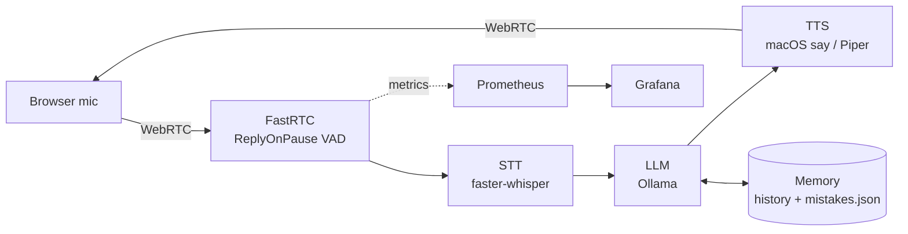
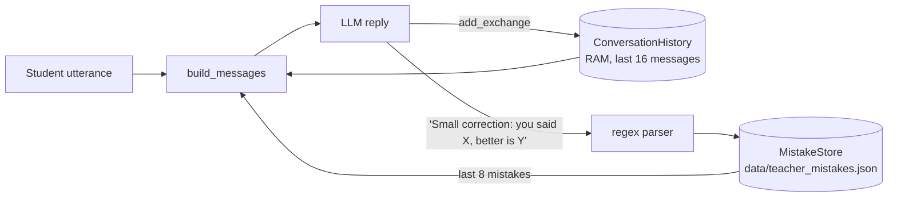

# Local English Teacher

A fully local, real-time **voice English tutor**. You speak, it listens, answers, corrects your most important mistake and remembers what you get wrong across sessions. No cloud APIs: speech recognition, the LLM and speech synthesis all run on your machine.



## Features

- **Voice conversation** over WebRTC with automatic end-of-speech detection
- **Teaching logic**: one targeted correction per turn, CEFR level (A1–C2) and topic control, e.g. a mock *MLOps engineer job interview*
- **Memory**: sliding-window conversation history + persistent mistake store that is fed back into the prompt so the teacher revisits weak spots
- **Pluggable TTS**: macOS `say` for zero-dependency dev, **Piper** (neural, cross-platform) in containers
- **Observability**: Prometheus metrics for per-stage latency (STT / LLM / TTS), end-to-end response time, tokens/s, errors, corrections; provisioned Grafana dashboard
- **Config as code**: `config.yaml` → environment variables → CLI flags
- **Quality gates**: unit tests with fake models (no GPU or model downloads in CI), ruff, GitHub Actions, Docker build + smoke test

## Quick start (macOS, native)

Requirements: [uv](https://docs.astral.sh/uv/), [Ollama](https://ollama.com) running.

```bash
ollama pull llama3.1:8b
uv sync
uv run english-teacher --config config.yaml

# Piper TTS (neural text-to-speech instead of macOS `say`)
make voice    # one-time: downloads the en_US-lessac-medium voice to models/ and installs the piper extra
uv run english-teacher --config config.yaml --tts piper
```

Open the URL printed in the terminal (default http://127.0.0.1:7860), click **Record**, speak, then **stay silent** — the reply comes after a short pause. Don't press Stop until you hear it.

Override anything from the CLI:

```bash
uv run english-teacher --config config.yaml --model qwen2.5:14b --whisper medium \
  --tts piper --level B2 \
  --topic "job interview for an MLOps engineer, the teacher is the interviewer"
```

### Monitoring

```bash
make up        # Prometheus :9090 + Grafana :3000 (admin / admin)
make run       # the app exposes metrics on :9100
```

The dashboard is provisioned automatically. Open it directly at <http://localhost:3000/d/english-teacher> (or: Dashboards → *English Teacher* folder → **Local English Teacher**). The Grafana home page may still show the default Home, because saved user/org preferences override the server default.

## Running in Docker (Linux)

```bash
make up-app    # teacher container + monitoring, Ollama on the host
make up-all    # everything incl. Ollama in a container
```

The image uses Piper TTS (voice baked into the image) and caches Whisper / VAD models in a volume.

> **macOS note:** run the app natively and only the monitoring stack in Docker. Ollama in Docker on macOS has no Metal GPU access (much slower), and WebRTC media from a container on Docker Desktop is not reachable from the host browser without a TURN server.

## Configuration

| Source | Example |
|---|---|
| `config.yaml` | `llm.model: llama3.1:8b` |
| Environment | `TEACHER_LLM__MODEL=llama3.1:8b`, `OLLAMA_HOST=...` |
| CLI | `--model llama3.1:8b` |

Later sources win. Unknown keys and invalid values (e.g. level `Z9`, `num_ctx < num_predict`) fail fast at startup.

Key settings: `llm.num_ctx` must cover system prompt + `teacher.max_history_messages` + reply. 4096 is plenty for ~8 spoken exchanges.

## How memory works

The teacher has two memories with different lifetimes (`src/english_teacher/memory.py`):



| | Conversation history | Mistake store |
|---|---|---|
| Class | `ConversationHistory` | `MistakeStore` |
| Lives in | process memory | `data/teacher_mistakes.json` |
| Survives restart | no | yes |
| Size limit | sliding window, `teacher.max_history_messages` (16) | last `teacher.max_mistakes_in_prompt` (8) are sent to the LLM |
| Purpose | the LLM is stateless, so the recent dialogue is re-sent every turn | the teacher steers the talk so the student practises weak forms again |

- **Writing mistakes:** the system prompt forces the format `Small correction: you said "X", better is "Y".`; `text.extract_correction()` parses it and `MistakeStore.add()` appends `{wrong, correct, date}`. If the model breaks the format the correction is still spoken but not stored.
- **Safety:** atomic writes (temp file + `os.replace`), a lock for thread safety, an empty file means "no mistakes yet", and an invalid JSON file is moved to `*.corrupt` instead of being overwritten.
- **Ordering:** a turn is saved *before* audio is streamed, so pressing Stop mid-answer does not lose it. A turn that ended in the LLM-error fallback is not remembered.
- **Reset:** `--reset-mistakes` clears the file.
- **Limits:** one shared history per process (not per WebRTC session), no deduplication or frequency ranking of mistakes, and Whisper may "fix" a mistake before the LLM ever sees it.

## Metrics

| Metric | Meaning |
|---|---|
| `teacher_stage_latency_seconds{stage}` | Histogram per stage: `stt`, `llm`, `tts` |
| `teacher_response_latency_seconds` | End of student speech → first audio chunk back |
| `teacher_llm_tokens_total{type}` | Prompt / completion tokens (history growth shows up here) |
| `teacher_llm_tokens_per_second` | Generation speed |
| `teacher_errors_total{stage}` | Failures per stage |
| `teacher_corrections_total` | Corrections given |
| `teacher_empty_transcripts_total` | Noise / silence that produced no text |
| `teacher_info{...}` | Running model, STT size, TTS backend, level |

## Development

```bash
make test      # pytest
make lint      # ruff check + format check
make check     # what CI runs
```

The pipeline (`src/english_teacher/pipeline.py`) receives STT, LLM and TTS as injected dependencies, so tests run against fakes in under a second and cover: full turn, memory reaching the prompt, LLM / TTS failures, empty transcripts, and memory being saved even when playback is interrupted.

```
src/english_teacher/
  app.py        # CLI, wiring, metrics server, FastRTC stream
  pipeline.py   # one conversation turn, instrumented
  config.py     # dataclass config: YAML < env < CLI, validation
  stt.py        # faster-whisper
  llm.py        # Ollama client + response parsing
  tts.py        # say / Piper backends
  memory.py     # history window + persistent mistake store
  prompts.py    # system prompt
  text.py       # TTS cleanup, correction parsing
  metrics.py    # Prometheus metrics
```
