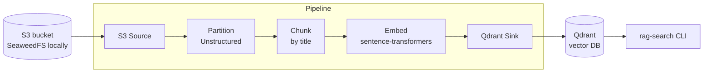

# RAG Ingestion Pipeline: S3 → Unstructured → Qdrant

A document ingestion pipeline that turns raw files stored in S3 (PDF, HTML, Markdown, plain text and more) into a searchable vector index in Qdrant. This is the "retrieval" half of a Retrieval-Augmented Generation (RAG) system: once documents are indexed, an LLM application can fetch the most relevant passages for any question and use them as grounded context.

The whole stack runs locally with Docker, with no cloud account or API keys required.

## Architecture



| Stage | What happens |
|---|---|
| **S3 Source** | Lists the bucket (with pagination), filters supported file types and downloads each file to a temporary directory. |
| **Partition** | Unstructured detects the file type and splits the document into typed elements such as `Title`, `NarrativeText`, `ListItem` and `Table`. |
| **Chunk** | Elements are grouped into chunks of up to 1000 characters that respect section boundaries, with a small overlap between consecutive chunks. |
| **Embed** | Each chunk is encoded into a 384-dimensional normalized vector with a local sentence-transformers model. |
| **Qdrant Sink** | Vectors are upserted together with their text and metadata (source URI, page number, element type). |

## Features

- **Format-agnostic parsing.** One code path handles PDF (including tables), HTML, Markdown, DOCX, PPTX, e-mail and plain text.
- **Structure-aware chunking.** Chunks follow document sections instead of cutting text at arbitrary character offsets, which keeps retrieved passages coherent.
- **Idempotent re-ingestion.** Point IDs are derived deterministically from the source URI and chunk index, and a document's old points are removed before new ones are written. Running the pipeline twice never creates duplicates.
- **Portable storage layer.** The S3 endpoint is configured through the standard `AWS_ENDPOINT_URL` variable, so the same code runs against real AWS S3, SeaweedFS, MinIO or moto without changes.
- **Fault isolation.** A file that fails to parse is logged and skipped; the rest of the batch still gets indexed.
- **Fully local.** No external APIs; the embedding model is downloaded once and runs on CPU.

## Tech Stack

| Area | Tool |
|---|---|
| Language & tooling | Python 3.12, [uv](https://docs.astral.sh/uv/), Ruff |
| Object storage | S3 API (SeaweedFS for local development), boto3 |
| Document parsing | [Unstructured](https://github.com/Unstructured-IO/unstructured) |
| Embeddings | [sentence-transformers](https://www.sbert.net/) (`all-MiniLM-L6-v2`) |
| Vector database | [Qdrant](https://qdrant.tech/) |
| Infrastructure | Docker Compose |

## Project Structure

```
s3-unstructured-qdrant/
├── docker-compose.yml        # SeaweedFS (S3) + Qdrant
├── pyproject.toml            # dependencies and CLI entry points
├── .env.example              # configuration template
├── sample_docs/              # example documents of a fictional company
│   ├── cloudnest_faq.html
│   ├── product_meeting_2026-09-15.txt
│   ├── quarterly_report_Q2_2026.pdf
│   └── remote_work_policy.md
└── src/rag_pipeline/
    ├── config.py             # settings loaded from environment / .env
    ├── s3_source.py          # source connector
    ├── processing.py         # partitioning and chunking
    ├── embedder.py           # text → vectors
    ├── qdrant_sink.py        # destination connector
    ├── ingest.py             # pipeline orchestration   (rag-ingest)
    ├── search.py             # semantic search CLI      (rag-search)
    └── seed.py               # uploads sample docs to S3 (rag-seed)
```

## Getting Started

### Prerequisites

- [uv](https://docs.astral.sh/uv/getting-started/installation/)
- Docker with Docker Compose

### 1. Start the infrastructure

```bash
docker compose up -d
```

This starts SeaweedFS with an S3-compatible API on port `8333` and Qdrant on port `6333`.

### 2. Install dependencies and configure

```bash
uv sync
cp .env.example .env
```

`uv` installs `Python 3.12` automatically if needed. The first `sync` takes a few minutes because PDF support in Unstructured pulls in PyTorch and layout-detection models.

### 3. Upload the sample documents

```bash
uv run rag-seed
# uv run rag-seed path/to/folder
```

### 4. Run the pipeline

```bash
uv run rag-ingest
```

The first run downloads the embedding model (about 90 MB).

```
INFO    Created collection 'documents' (dim=384)
INFO    cloudnest_faq.html                             16 elements ->   8 chunks
INFO    product_meeting_2026-09-15.txt                 12 elements ->   4 chunks
INFO    quarterly_report_Q2_2026.pdf                   ...
INFO    remote_work_policy.md                          17 elements ->   5 chunks
INFO    Done in ...s: 4 documents, ... chunks, 0 failed
```

### 5. Search

```bash
uv run rag-search "How do I restore a deleted file?"
uv run rag-search "What was CloudNest revenue in Q2?" -k 5
uv run rag-search "Why was version 3.0 delayed?"
uv run rag-search "How much is the home office budget?"
```

Each result shows its similarity score, source file, page number (for PDFs) and a preview of the matching chunk. The indexed data can also be browsed in the Qdrant dashboard at <http://localhost:6333/dashboard>.

## Configuration

All settings are read from environment variables or the `.env` file.

| Variable | Default | Description |
|---|---|---|
| `AWS_ENDPOINT_URL` | – | S3 endpoint. Remove it to use real AWS S3. |
| `AWS_ACCESS_KEY_ID` / `AWS_SECRET_ACCESS_KEY` | – | S3 credentials (any value works with local SeaweedFS). |
| `S3_BUCKET` | `documents` | Source bucket. |
| `S3_PREFIX` | *(empty)* | Only process keys under this prefix. |
| `QDRANT_URL` | `http://localhost:6333` | Qdrant instance URL. |
| `QDRANT_API_KEY` | – | Required for Qdrant Cloud. |
| `QDRANT_COLLECTION` | `documents` | Target collection. |
| `EMBED_MODEL` | `sentence-transformers/all-MiniLM-L6-v2` | Any sentence-transformers model. |
| `PARTITION_STRATEGY` | `auto` | `fast`, `hi_res` (better for tables and scans) or `ocr_only`. |
| `CHUNK_MAX_CHARS` | `1000` | Hard upper limit for chunk length. |
| `CHUNK_SOFT_MAX_CHARS` | `800` | Start a new chunk after this many characters. |
| `CHUNK_OVERLAP` | `100` | Characters shared between consecutive chunks. |

Changing `EMBED_MODEL` changes the vector size, so drop the collection (or use a new `QDRANT_COLLECTION` name) before re-ingesting.

### Running against real AWS and Qdrant Cloud

Remove `AWS_ENDPOINT_URL` from `.env`, set real AWS credentials and your bucket name, then point `QDRANT_URL` and `QDRANT_API_KEY` at your Qdrant Cloud cluster. No code changes are needed.

## Design Decisions

**Why chunk by title?** Fixed-size chunking often splits a sentence or a table in half. `chunk_by_title` starts a new chunk at section headings, so a retrieved passage usually covers one topic, which directly improves answer quality in a RAG system.

**Why a local embedding model?** It keeps the demo free and self-contained. `all-MiniLM-L6-v2` is small and fast on CPU.

## Limitations

- **Retrieval only.** The natural next step is a generation layer that passes the top-k chunks to an LLM and returns an answer with citations.
- **Dense search only.** Adding sparse vectors (BM25/SPLADE) for hybrid search would improve matching on exact terms such as product names and numbers.


## Sample Data

The documents in `sample_docs/` describe a fictional company, Amber Soft, and its product CloudNest Backup. All names, figures and e-mail addresses are made up. The set deliberately mixes formats and content types (policy text, FAQ with a pricing table, meeting notes, a PDF report with a financial table) to exercise different parsing paths.
