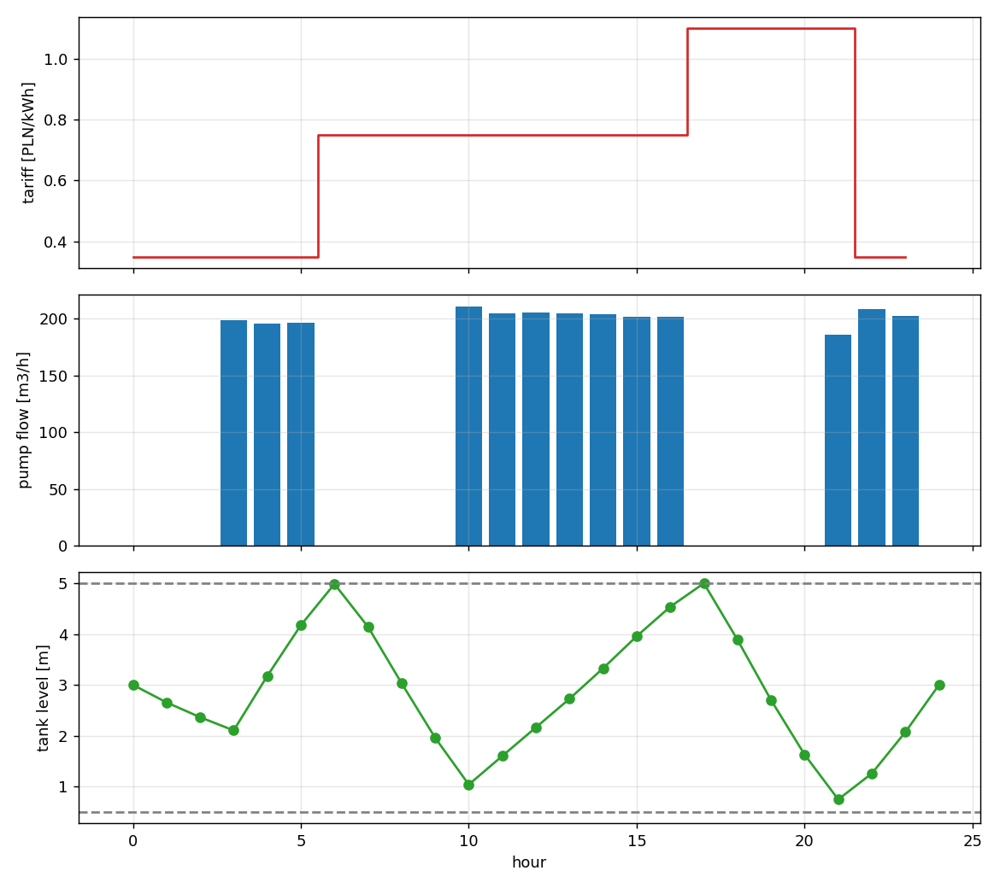

# Pump scheduling on a looped water network — SOS2 linearisation + MILP

Least-cost on/off scheduling of a fixed-speed pump, on a small looped
distribution network with an elevated storage tank. All hydraulic
nonlinearities (head loss, pump head curve, pump power curve) are replaced by
piecewise-linear interpolations built from **SOS2** sets of convex weights, so
the whole problem is a single MILP.

---

## 1. The network

```
    S            low-level source / intake, fixed head 10 m
    |
    p0 + PUMP    pump station (fixed speed, on/off)
    |
    A            discharge header (junction, no demand)
   / \
  p1   p3
  /      \
 B --p2-- C      demand nodes, elevation 70 / 72 m, min pressure 25 m
           \
            p4 + throttle valve
              \
               T   floating tank, bottom 101 m, level 0.5-5.0 m, 150 m2
```

The pump feeds the **whole** network — every cubic metre delivered passes
through it. T is an ordinary floating tank: it fills while the pump runs and
supplies B and C by gravity while it does not, so the tank level and the
service-pressure limits are directly coupled. Drain the tank too far and C
drops below its 25 m minimum.

With A dead-ended during off hours the loop can circulate `C → A → B`, so
**every network pipe is reversible** and needs a signed breakpoint grid. That
is the main reason the MILP is as large as it is.

## 2. Model formulation
## 2. Model formulation

Index `t = 0…23` (hourly periods, `Δt = 1 h`), `j` over pipes, `k` over
breakpoints.

### 2.1 Mass balance

At each junction `n`:

```
Σ_{j into n} q[j,t]  −  Σ_{j out of n} q[j,t]  =  d[n,t]
```

Tank (open, constant cross-section `A_T`):

```
y[t+1] = y[t] + ( q_p4[t] − d_T[t] ) · Δt / A_T
y_min ≤ y[t] ≤ y_max,      y[0] = y_init,      y[24] ≥ y_init
```

The last constraint makes the day cyclic — otherwise the optimiser simply
drains the tank and pumps nothing.

### 2.2 Energy / head relations

Nodal-head formulation, which enforces loop energy balance automatically
(`Δh_p1 + Δh_p2 = Δh_p3` follows from the three head equations, so no explicit
loop equations are needed):

```
H[start(j),t] − H[end(j),t] = Δh[j,t]           for gravity pipes
H[C,t] + h_pump[t] − Δh[p4,t] − H[T,t] = s[t]   for the pump link
H[T,t] = z_bottom + y[t]
H[A,t] = 100 m
H[n,t] ≥ elevation[n] + p_min[n]
```

Head loss is Hazen-Williams, with `q` in m³/h:

```
Δh(q) = R · q · |q|^0.852,    R = 10.67 · L / (C^1.852 · D^4.87) · (1/3600)^1.852
```

### 2.3 SOS2 piecewise linearisation

For every link `j` and period `t`, with breakpoints `Q[j,k]` and tabulated
values `Φ[j,k] = Δh(Q[j,k])`:

```
q[j,t]  = Σ_k Q[j,k] · λ[j,t,k]
Δh[j,t] = Σ_k Φ[j,k] · λ[j,t,k]
Σ_k λ[j,t,k] = 1            (gravity pipes)
λ[j,t,·] is SOS2            (at most two adjacent weights nonzero)
```

Because `Δh(q) = R q|q|^0.852` is **nonconvex** (convex for `q > 0`, concave for
`q < 0`) and appears in an **equality**, a convex-combination model alone is not
enough — the SOS2 adjacency condition is what forces the weights onto a single
segment of the curve. That is the whole reason SOS2 is the right tool here.

Breakpoint placement is not uniform. The second derivative of `q|q|^0.852`
blows up at `q = 0`, so the grid is refined there:
`Q_k = q_max · (k/n)^1.6`.

### 2.4 The pump, and the on/off trick

The same λ-set carries four quantities for the pump link:

```
q_p4[t]   = Σ_k Q_k λ[k]          flow
Δh_p4[t]  = Σ_k Φ_k λ[k]          pipe friction on p4
h_pump[t] = Σ_k h(Q_k) λ[k]       pump head,  h(q) = h0 − r q²
P[t]      = Σ_k P(Q_k) λ[k]       shaft power, P = ρ g q h(q) / η(q)
```

with the efficiency curve `η(q) = η_bep · (2x − x²)`, `x = q/q_bep`.

The on/off disjunction is expressed by changing one right-hand side:

```
Σ_k λ[p4,t,k] = z[t]        instead of  = 1
```

When `z[t] = 0` every weight is zero, so flow, pump head and power all collapse
to zero exactly — no big-M needed for the operating point. Because the
breakpoint grid starts at `q_min` (not at 0), the pump's minimum-flow limit is
enforced for free whenever `z[t] = 1`.

One big-M is still needed, on the pump-link *head* equation. When the pump is
off the check valve shuts and the two sides of p4 decouple, so the equation must
be released:

```
−M(1 − z[t]) ≤ s[t] ≤ M(1 − z[t])
```

**Note on what is and is not a decision.** The pump flow is *not* free. Given
the demands and the tank level, the head equation
`H_C + h(q) − Δh_p4(q) = H_T` intersects the pump curve with the system curve
and pins `q` to a single value. The only real binary decision is `z[t]`; the
model reports the resulting operating point (in the shipped case ~134–145 m³/h,
drifting down as the tank fills). This is the behaviour you want from an
on/off model, and it is why the pump curve has to be in the model at all
rather than assuming a fixed flow rate.

### 2.5 The floating tank and the throttle valve

When the tank hangs off the network rather than sitting behind the pump, two
extra pieces are needed.

**Throttle / altitude valve — why it is there.** This was not in the model
originally; it was added because without it the MILP came back *infeasible*,
and the reason turned out to be physical rather than a coding mistake.

A fixed-speed pump has exactly one head curve. The tank surface, however, is a
state variable that moves between 101.5 m and 106 m, and network friction moves
with demand between 52 and 178 m³/h. The operating point is wherever the pump
curve meets the system curve — but nothing guarantees that intersection lies
inside the pump's flow window `[q_min, q_max]` for every combination of level
and demand. The failing case is a **high tank with low demand**: the pump at
its minimum flow of 100 m³/h still produces about 115 m of head, which puts C
far above the tank surface, and the head equality `H_C − H_T = Δh_p4(q_p4)`
would demand a filling flow larger than the pump is delivering. No feasible
point exists, and the MILP reports infeasible at a single discrete time step.

Real pumping stations solve this with an altitude or control valve at the tank
inlet, which throttles to absorb the surplus head. So the model gets one:

```
H_C − H_T = Δh_p4(q_p4) + θ[t],     0 ≤ θ[t] ≤ θ_max · fill[t]
q_p4[t] ≤ q_max · fill[t],          q_p4[t] ≥ −q_max · (1 − fill[t])
```

`fill[t]` is a direction binary; θ may only dissipate in the filling direction,
because allowing it while the tank drains would let the model deliver flow with
less head than physics permits and would *understate* pressure at B and C.
**It is also a diagnostic, and that is arguably its more useful role.** θ is
head the station generates and then destroys, so it is wasted energy. The first
pump fitted to this network (h₀ = 135 m, r = 4.5e-4) ran with a mean θ of
**18.6 m** — a clear signal that it was over-sized in head. Re-fitting the curve
against the actual system curve (static lift 91.5–96 m plus ~5 m friction at the
duty point, so the curve should cross ~99 m at ~200 m³/h) gave h₀ = 121 m,
r = 5.5e-4, which cut θ to **0.87 m** and saved **17% of the energy**
(1064 → 881 kWh/day) before any scheduling optimisation at all. A steep curve
self-regulates: the operating point moves instead of the valve opening.

Watch the `throttle valve loss` line in the output. If the mean is more than a
metre or two, fix the pump selection before reading anything into the schedule.

**The shipped pump was chosen by hand, not optimised.** `pump_sizing.py` exists
to check that hand-sizing, by sweeping the head curve and re-solving the whole
schedule for each candidate:

```
python pump_sizing.py --mode h0     # sweep shut-off head, r fixed
python pump_sizing.py --mode r      # sweep curve steepness, h0 fixed
```

```
 h0 [m]  throttle   energy      cost
    112     0.98m      898    644.86
    118     1.92m      886    623.88
    121     0.78m      881    593.93   <- hand-picked
    127     1.37m      911    622.64
    135     9.25m      990    664.04
```

The hand-picked curve happens to come out best in this sweep, but read that as
a coarse grid confirming a back-of-envelope calculation, not as evidence of an
optimum — the spacing is 6–8 m and nothing was searched between the points.

The sweep does establish two things that matter more than the winner:

* **Pump selection dominates scheduling here.** The spread across the sweep is
  70 PLN/day (11.8%), while shifting load against the tariff with a fixed pump
  is worth 14 PLN/day. Getting the pump right is a 5× bigger lever than getting
  the schedule right. If you take one thing from this repository, take that.
* **Throttle loss alone is not a sufficient criterion.** The 112 m candidate
  runs at a lower mean throttle (0.98 m) than the 127 m one (1.37 m) yet costs
  22 PLN/day more, because it is too weak to reach a useful duty flow and has
  to run 16 h instead of 12. θ diagnoses over-sizing in head; it says nothing
  about under-sizing.

What this is **not**: a pump selection method. It varies two coefficients of an
idealised parabola, on one day's demand profile, with efficiency held fixed.
Real selection means discrete catalogue curves, NPSH margins, motor frames,
several demand scenarios (summer/winter, fire flow, pipe ageing) and capital
cost. The curve here is fitted to a single profile and would be over-fitted to
it if anyone treated the result as a recommendation.

**Overflow.** A `spill[t] ≥ 0` term in the tank balance keeps the model
feasible if the tank would be driven over `y_max`. Spilling is never profitable
(the water was pumped at a cost), so the optimiser avoids it unprompted.

### 2.6 Commitment constraints

```
su[t] − sd[t] = z[t] − z[t−1]
Σ_{τ=t−T_up+1}^{t} su[τ] ≤ z[t]
Σ_{τ=t−T_dn+1}^{t} sd[τ] ≤ 1 − z[t]
```

### 2.7 Objective

```
min  Σ_t  c[t] · P[t] · Δt   +   c_start · Σ_t su[t]
```

with `c[t]` a three-zone tariff (night 0.35, day 0.75, evening peak 1.10).

### 2.8 Valid inequalities

The source is the only supply, so everything the network consumes must have
been pumped, and `q_p0 ≤ q_max·z` gives a lower bound on run time:

```
Σ_t q_p4[t]·Δt ≥ V_required
Σ_t z[t]       ≥ ⌈V_required / (q_max·Δt)⌉
```

A second one: with the pump off the source is disconnected, so the tank is the
only supply and must be draining —

```
fill[t] ≤ z[t]        (whenever the network draws anything in period t)
```

Both tighten the LP relaxation and cut solve time.

**Caveat, and it bit this code once.** `V_required` is only equal to the demand
when the tank is cyclic. Under `--no-cycle` the tank may legitimately finish
empty, so the requirement drops by `(y_init − y_min)·A_T`; omitting that term
makes the inequality *invalid* and silently returns a worse schedule (73.18 PLN
instead of the true 63.06 PLN on the shipped `zone` case — a 14% error with no
warning). `verify.py` catches this class of mistake by re-solving with the cut
deactivated and comparing.

## 3. Installation

```bash
pip install pyomo
pip install highspy          # solver, works with --sos2 binary
# optional
sudo apt-get install coinor-cbc     # supports native SOS2
pip install matplotlib              # only for --plot
```

## 4. Usage

```bash
# recommended: HiGHS with the explicit binary SOS2 encoding
python pump_scheduling.py --solver appsi_highs --sos2 binary --bp-pipe 5

# solver-level SOS2 constraints (CBC, Gurobi, CPLEX, SCIP)
python pump_scheduling.py --solver cbc --sos2 native --time-limit 300

# export
python pump_scheduling.py --solver appsi_highs --sos2 binary \
       --csv schedule.csv --plot schedule.png
```

| flag | meaning |
|---|---|
| `--solver` | `cbc`, `appsi_highs`, `gurobi`, `cplex`, `scip` |
| `--sos2` | `native` (solver SOS2) or `binary` (interval binaries) |
| `--bp-pipe` | breakpoints per side for gravity pipes (default 7) |
| `--bp-pump` | breakpoints across the pump operating window (default 9) |
| `--gap` | relative MIP gap (default 1e-4) |
| `--time-limit` | seconds |
| `--no-cycle` | drop the end-of-day tank level constraint |
| `--csv`, `--plot` | write results |
| `--tee` | show the solver log |

### Which SOS2 encoding

`native` produces a much smaller model (72 binaries vs 936) because branching
happens inside the solver, but it needs a solver with real SOS2 support, and CBC
in particular branches on SOS2 poorly here — it did not close the gap in
300 s on the shipped case. `binary` writes the adjacency condition out
explicitly:

```
Σ_i w[j,t,i] = 1 (or z[t]),      λ[k] ≤ w[k−1] + w[k]
```

which is bigger but works with any MILP solver and, with HiGHS, proves
optimality in ~80 s. Use `native` if you have Gurobi or CPLEX.

## 5. Reference result



```
hour tariff  on   q_pump  h_pump  power  tank_lv  q_tank   H_B     H_C   margin
   0   0.35   0      0.0    0.00    0.0    3.000   -51.8  103.53  103.59   6.59
   3   0.35   1    198.7   99.25   67.2    2.103   160.7  108.34  106.33   9.33
   5   0.35   1    196.5   99.72   66.8    4.174   121.8  108.73  107.12  10.12
   7   0.75   0      0.0    0.00    0.0    4.143  -166.8  101.27  101.72   4.72
   9   0.75   0      0.0    0.00    0.0    1.958  -138.0  100.14  100.48   3.48
  10   0.75   1    211.3   96.40   69.7    1.038    84.8  105.19  103.77   6.77
  16   0.75   1    201.6   98.62   67.8    4.538    69.3  107.48  106.25   9.25
  17   1.10   0      0.0    0.00    0.0    5.000  -166.8  102.13  102.58   5.58
  20   1.10   0      0.0    0.00    0.0    1.627  -132.2  100.02  100.34   3.34
  21   1.10   1    185.9  101.98   64.9    0.745    76.7  111.00  109.83  12.83
  23   0.35   1    202.5   98.43   67.9    2.072   139.3  107.42  105.59   8.59

pump run time            : 13.0 h  (3 start-ups)
volume pumped into network: 2,622.0 m3   (100% of demand)
tightest pressure margin : 3.34 m above the limit
throttle valve loss      : max 7.22 m, mean over running hours 0.87 m
tank level  start / end  : 3.000 m / 3.000 m
electrical energy        : 881.48 kWh   (0.3362 kWh/m3)
TOTAL                    : 593.68 PLN
same energy at flat average tariff 0.690 PLN/kWh: 607.86 PLN
```

Things worth reading off this:

* The pump charges the tank to 5.00 m by 17:00 and rides out most of the
  1.10 evening block — but it **cannot skip it entirely**. By 21:00 the tank is
  down to 0.745 m against a 0.5 m floor, so it is forced to start at peak
  tariff. Storage, not tariff, is the binding resource: the tank holds 675 m³
  against 747 m³ of demand in the 17:00–21:00 block.
* At 20:00 the pressure margin falls to 3.34 m. The tank cannot be drawn any
  lower without violating the 25 m service pressure at C — the level bound and
  the pressure bound become active at nearly the same moment.
* Flow reverses in p4 every cycle (+160 m³/h filling, −167 m³/h supplying),
  which is exactly why that link needs a **signed** breakpoint grid.
* Load shifting is worth only 14 PLN/day here (594 vs 608 at the flat average).
  That is honest: with storage this tight there is not much to shift. Doubling
  the tank is the intervention worth costing, and the model is the tool to
  price it.

## 6. Linearisation accuracy

Every run ends with a check that recomputes exact Hazen-Williams losses from
the optimised flows and compares them against the PWL values:

```
mean |error| over active links : 0.0157 m
worst link                     : p3 at hour 13, PWL 2.771 m vs exact 2.713 m
```

Accuracy vs cost (HiGHS, `--sos2 binary`):

| `--bp-pipe` | binaries | mean err | worst err | wall time |
|---|---|---|---|---|
| 4 | 600 | 0.062 m | 0.228 m | 45 s |
| 5 | 696 | 0.031 m | 0.097 m | 75 s |
| 7 | 936 | 0.016 m | 0.058 m | 80 s |

Sub-0.1 m residuals are well inside the 20 m pressure margin, so the schedule
is safe. If your margins are tight, raise `--bp-pipe` or re-run the chosen
`z[t]` through a proper simulator (see below).

## 7. Verifying the code

`verify.py` audits a solved model **without reusing any of its constraints**:
it pulls the raw variable values out and re-derives the physics from the `Case`
data. It checks nodal and tank mass balance, the global volume balance, the
head balance against *exact* Hazen-Williams (not the PWL approximation), all
bounds, minimum up/down times, and recomputes the objective from the exact pump
curves.

```bash
python verify.py
python verify.py --no-cycle
```

Current output:

```
=== audit ===
    nodal mass balance     max residual 1.14e-13 m3/h
    tank balance           max residual 2.02e-14 m
    global volume balance  in 2622.0 = out 2622.0 + stored 0.0 + spill 0.0
    exact head balance     max residual 0.118 m at ('p3', 21)
    on/off runs            offx3, onx3, offx4, onx7, offx4, onx3
    objective              model 593.68 vs recomputed from exact curves 593.53 (-0.03%)
    all checks passed
```

Mass balances close to machine precision, so the network assembly is right.
The head-balance residual of 0.118 m is the linearisation error and nothing
else — it is the number to watch if you tighten pressure margins. The objective
recomputed from the exact curves lands within 0.03% of the model's, which is
the useful statement: **the schedule is worth what the model says it is**, even
though the flows it was derived from are approximate.

## 8. `verify.py` vs `simulate.py` — residual check vs real simulation

These answer different questions and it is worth not confusing them.

**`verify.py` does not solve the nonlinear system.** It substitutes the MILP's
own `q`, `H`, `y` into the exact equations and measures the residual. It tells
you whether the model's numbers are self-consistent — which catches sign
errors, missing terms and wrong topology — but it cannot tell you what happens
when you actually run the schedule.

**`simulate.py` throws the MILP's flows and heads away.** It keeps only the
*decisions* (the on/off vector `z[t]` and the throttle setpoint), then re-solves
the nonlinear network with `fsolve` at every sub-step and integrates the tank
level forward. Pipe flows come from inverting `Δh = R q|q|^0.852`; the pump
flow is found by bisecting `H_up + h(q) − R q^1.852 = H_dn`, which is strictly
decreasing in `q` and so has a unique root.

```bash
python simulate.py --substeps 1 6 12 60
```

```
schedule z = 000111000011111110000111
MILP says      : cost  593.68 PLN   energy 881.5 kWh   y_end 3.000 m   margin 3.34 m
sim ( 1 step /h): cost  594.36 PLN   energy 882.5 kWh   y_end 3.012 m   margin 3.43 m
                  overflow 5.2 m3
sim ( 6 steps/h): cost  593.07 PLN   energy 880.2 kWh   y_end 2.965 m   margin 2.62 m
sim (12 steps/h): cost  592.94 PLN   energy 880.0 kWh   y_end 2.957 m   margin 2.52 m
sim (60 steps/h): cost  592.84 PLN   energy 879.8 kWh   y_end 2.951 m   margin 2.44 m
```

Running at `--substeps 1` reproduces the MILP's own assumption (tank level held
at its start-of-hour value), so the difference between that row and the MILP is
pure **linearisation** error. The difference between `1` and `60` is pure
**time-discretisation** error. Separating them matters, because they do not
affect the two outputs equally:

* **Cost is reliable.** 592.84 vs 593.68 PLN, an error of 0.14%. The schedule
  is worth what the model says it is worth.
* **The pressure margin is not.** The model reports 3.34 m; the true value is
  **2.44 m**, so the model is optimistic by 0.90 m — about 27% of the margin,
  and roughly 7× the 0.118 m head-loss residual that `verify.py` reports.

That last point corrects something the residual check appears to say. A 0.118 m
residual looks negligible against a 3.34 m margin, and it is tempting to
conclude the schedule has plenty of room. It does not: errors compound through
the tank trajectory, because a slightly wrong flow gives a slightly wrong level,
which shifts the head at C for every subsequent hour. **Do not size pressure
margins from the residual — simulate.** The values converge by roughly
12 sub-steps per hour, so 5-minute steps are enough to trust.

The `--substeps 1` run also overflows 5.2 m³, which the finer runs do not: an
artefact of the hourly step, not a real operating problem.

## 9. Limitations and honest caveats

* **The MILP solves linearised hydraulics, not exact hydraulics.** Use
  `simulate.py` (§8) or EPANET before trusting a schedule operationally. The
  right workflow is MILP for the combinatorics, simulator for verification —
  and as §8 shows, the verification is not a formality: it moved the pressure
  margin by 27%.
* **Deterministic demand.** No forecast error. A rolling-horizon re-solve
  every hour with updated forecasts and the measured tank level is the usual
  fix, and the model is already set up for it — change `level_init_m` and the
  tariff/demand vectors and re-solve.
* **One pump, fixed speed.** Multiple parallel pumps need a λ-set per unit
  plus a shared discharge head; variable speed needs a second continuous
  dimension (affinity laws) and hence a 2-D PWL, where SOS2 no longer suffices
  — use a triangulated model instead.
* **Big-M on the pump-link head equation** is set to 400 m. It is loose but
  safe for this head range; tighten it if you enlarge the network, since a
  loose big-M weakens the relaxation.
* **Water quality, minimum tank turnover, and leakage are not modelled.**
  Cost-optimal schedules tend to stratify tanks; a minimum-turnover constraint
  is usually added in practice.
* **The throttle valve is an escape hatch as well as a physical component.**
  If reported throttle losses are large, treat it as a sizing warning rather
  than a result: the schedule is then paying for head it immediately destroys.
* **The tank head equation uses the level at the *start* of each interval.**
  For long steps this is a real approximation and is what makes the throttle
  necessary. Using the mid-interval level `(y[t]+y[t+1])/2` is a common
  alternative; it is smoother but couples consecutive periods more tightly.

## 10. Adapting to your own data

Everything lives in `default_case()`:

* `Pipe(name, start, end, length_m, diameter_m, hw_c, q_max_m3h, allow_reverse)`
  — `q_max_m3h` also sets the breakpoint span, so keep it realistic; an
  oversized range wastes resolution.
* `Pump(h0_m, r_curve, q_min, q_max, q_bep, eta_bep, min_up_h, min_down_h,
  start_cost, initial_on)` — fit `h0` and `r_curve` to your manufacturer curve
  by least squares on `h = h0 − r q²`.
* `Tank(bottom_elev_m, area_m2, level_min_m, level_max_m, level_init_m)`.
* `demand_m3h` — one list per node, any horizon length; `tariff` sets the
  number of periods, so the two must match.
* Sub-hourly resolution: set `dt_h=0.25` and supply 96-element profiles.

Adding a node or pipe requires no code changes beyond the dictionaries — mass
balance, head equations and breakpoint grids are all built from them.

---

MIT licence. Example code, not production software.
