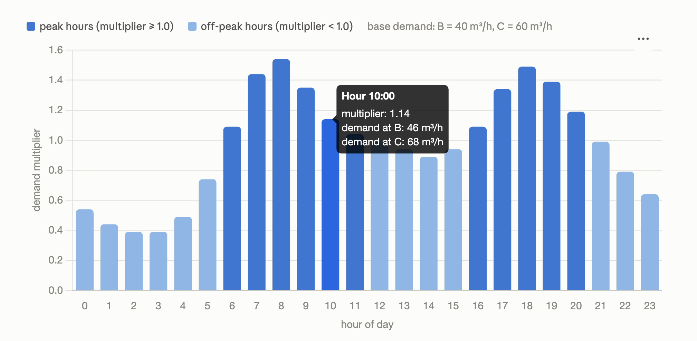
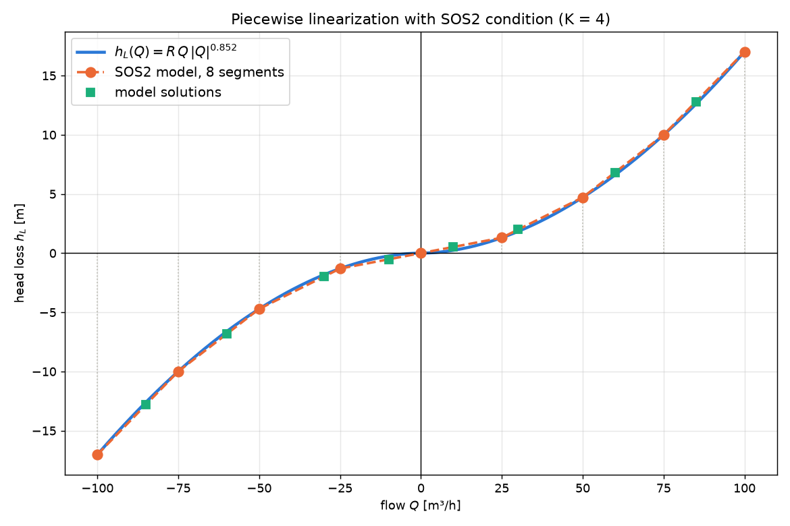
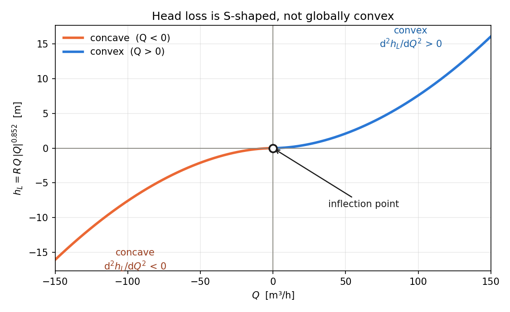
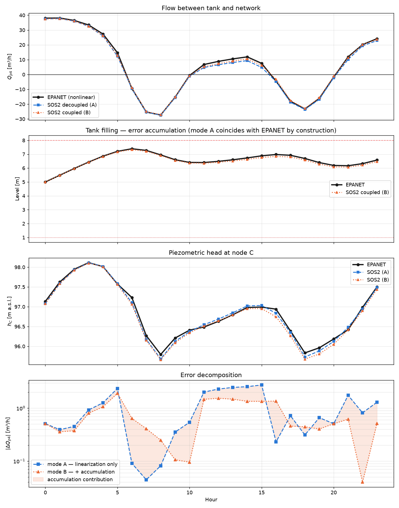

# Nonlinear vs linearized water distribution network model

**What the script does:** it solves the same water distribution network with two methods and shows how much the mathematical simplification costs — the simplification we need in order to *optimize* the network later.

**Reading time:** ~25 minutes. **Run time:** ~30 seconds.

---

## Table of contents

1. [Quick start](#1-quick-start)
2. [The problem in three sentences](#2-the-problem-in-three-sentences)
3. [Glossary](#3-glossary)
4. [The network we model](#4-the-network-we-model)
5. [Physics: where the equations come from](#5-physics-where-the-equations-come-from)
6. [Why the equations are hard](#6-why-the-equations-are-hard)
7. [Method 1: nonlinear solver (EPANET)](#7-method-1-nonlinear-solver-epanet)
8. [Method 2: linearization with SOS2](#8-method-2-linearization-with-sos2)
9. [Two comparison modes — and why separate them](#9-two-comparison-modes--and-why-separate-them)
10. [Code structure](#10-code-structure)
11. [How to read the results](#11-how-to-read-the-results)
12. [The most interesting result: negative feedback](#12-the-most-interesting-result-negative-feedback)
13. [Common pitfalls](#13-common-pitfalls)
14. [Exercises](#14-exercises)
15. [Where to go next](#15-where-to-go-next)

---

## 1. Quick start

```bash
# install uv (once)
curl -LsSf https://astral.sh/uv/install.sh | sh

# run — uv fetches the dependencies itself
uv run compare_epyt.py
```

Files needed in the same directory:

```
compare_epyt.py       ← the script
network.inp           ← network description (EPANET format)
```

The script prints tables to the console and saves `comparison_epyt.png`.

> **No uv?** `pip install pulp numpy matplotlib epyt` and `python compare_epyt.py` works too. But `uv` is more convenient — it doesn't clutter your system.

---

## 2. The problem in three sentences

A water distribution network is described by a **system of nonlinear equations** — head losses grow with flow to the power of ~1.85, not linearly.

For **simulation** that's not a problem: Newton's method handles it well (that's how EPANET works).

But for **optimization** (e.g. "which pipe diameters should I pick to minimize cost while keeping pressure adequate?") we need a linear model, because LP/MILP solvers can minimize an objective function and nonlinear solvers usually cannot. **This script measures how much accuracy we lose in that trade.**

---

## 3. Glossary

Read this before diving into the code — without it the rest is fog.

| Term | What it means |
|---|---|
| **Node** | a point in the network: a pipe junction, a demand point, a tank |
| **Link / pipe** | a segment connecting two nodes |
| **Demand** | how much water consumers draw at a given node [m³/h] |
| **Hydraulic head** $h$ | the "energy level" of the water at a node [m a.s.l.]. Water flows from higher $h$ to lower. Not the same as pressure — $p = h - \text{ground elevation}$ |
| **Head loss** $h_L$ | how much energy the water loses to friction in a pipe [m] |
| **Reservoir** | a source at *constant* head (a river, an intake). Unlimited water |
| **Tank** | a storage tank at *variable* level — it fills and empties |
| **EPS** | Extended Period Simulation — simulation over time (here 24 steps of 1 h), as opposed to a single steady-state calculation |
| **LP** | Linear Programming — optimization with linear equations |
| **MILP** | Mixed Integer LP — LP plus integer variables (here: 0/1) |
| **SOS2** | Special Ordered Set of type 2 — a special constraint, explained in §8 |

---

## 4. The network we model

```
        A  ← reservoir, h = 100 m (constant, e.g. a water tower)
       / \
     p1   p3
     /       \
    B --p2--- C
               |
              p4
               |
               T  ← open tank, variable level
```

Water flows from A to the consumers at B and C. Tank T acts as a **buffer**: at night (low demand) it fills up, during peaks (high demand) it feeds water back into the network.

### Pipe parameters (from `network.inp`)

| Pipe | From → To | Length | Diameter | C (roughness) |
|---|---|---|---|---|
| p1 | A → B | 500 m | 150 mm | 130 |
| p2 | B → C | 400 m | 125 mm | 130 |
| p3 | A → C | 600 m | 150 mm | 130 |
| p4 | C → T | 300 m | 125 mm | 130 |

**Coefficient C** is the Hazen-Williams roughness: the higher, the smoother the pipe. 130 ≈ cast iron, 150 ≈ PE/PVC.

### Time-varying demand

Demand is not constant — people use water on a daily rhythm:



**Vertical axis (multiplier)** — a dimensionless coefficient we multiply the base demand by:

$$D_i(t) = D_i^{\text{base}} \cdot \mu(t)$$

Node B has a base demand of 40 m³/h, so:
- at 2:00 (μ = 0.40) → 40 × 0.40 = **16 m³/h**
- at 8:00 (μ = 1.55) → 40 × 1.55 = **62 m³/h**

Almost a fourfold difference between the night minimum and the morning peak.

**Horizontal axis** — hours of the day, 0–23. These are the 24 values of the `DAILY` pattern.

**Bar height** — the taller, the higher the consumption.

#### Why this shape

The pattern reflects the daily rhythm of a household:

| Period | Hours | μ | What's happening |
|---|---|---|---|
| Night | 1–4 | 0.40–0.50 | people asleep, minimal use |
| Morning peak | 7–9 | 1.45–1.55 | showers, breakfast, leaving for work |
| Daytime | 12–15 | 0.90–1.00 | moderate, stable |
| Evening peak | 17–19 | 1.35–1.50 | coming home, cooking, baths, laundry |
| Late evening | 22–23 | 0.65–0.80 | consumption tapers off |

It is exactly this shape that forces the tank to work: **at night the surplus fills it, during peaks the tank feeds the network** — hence the four sign changes of $Q_{p4}$ at hours 6, 11, 16 and 21.

## Where those numbers live in the code

They are simply a list of 24 values in `network.inp`:

```ini
[PATTERNS]
;ID       Multipliers
 DAILY    0.55  0.45  0.40  0.40  0.50  0.75    ← hours 0-5
 DAILY    1.10  1.45  1.55  1.35  1.15  1.05    ← hours 6-11
 DAILY    1.00  0.95  0.90  0.95  1.10  1.35    ← hours 12-17
 DAILY    1.50  1.40  1.20  1.00  0.80  0.65    ← hours 18-23
```

EPANET reads them in order — each row is the next 6 hours; the line breaks are purely cosmetic.

---

### The flow sign convention

**This is critical for understanding the results.** Pipe p4 is defined as "C → T", so:

- $Q_{p4} > 0$ → water flows **from the network into the tank** (filling)
- $Q_{p4} < 0$ → water flows **from the tank into the network** (emptying)

Same pipe, same sign convention in the code — only the value changes. The model **must handle both directions**, and that is the source of all the complication in §8.

---

## 5. Physics: where the equations come from

The model rests on two conservation laws. They are exact counterparts of Kirchhoff's laws from electrical engineering — if you know those, you get this for free.

### 5.1. Conservation of mass (Kirchhoff's first law)

*Whatever flows into a node must flow out or be drawn off.*

For every demand node:

$$\sum_j Q_{ij} = D_i$$

Concretely, in our case:

```
Node B:  Q_p1 - Q_p2 = D_B        (p1 flows in, p2 flows out, the rest is demand)
Node C:  Q_p2 + Q_p3 - Q_p4 = D_C
```

These equations are **linear** — just additions and subtractions. No problem.

### 5.2. Conservation of energy (Kirchhoff's second law)

*The difference in energy level between two nodes equals the loss in the pipe connecting them.*

$$h_{\text{start}} - h_{\text{end}} = h_L(Q)$$

Concretely:

```
p1:  h_A - h_B = h_L(Q_p1)
p2:  h_B - h_C = h_L(Q_p2)
p3:  h_A - h_C = h_L(Q_p3)
p4:  h_C - h_T = h_L(Q_p4)
```

And here the problem begins, because the function $h_L$ is nonlinear.

### 5.3. The head loss formula (Hazen-Williams)

$$h_L = \frac{10.67 \cdot L}{C^{1.852} \cdot D^{4.87}} \cdot Q^{1.852}$$

Everything before $Q$ is a constant that depends on the pipe geometry — we collect it into a single coefficient $R$:

$$h_L = R \cdot Q^{1.852}$$

**But this only works for $Q > 0$.** For reverse flow we need a two-sided version:

$$\boxed{h_L(Q) = R \cdot Q \cdot |Q|^{0.852}}$$

Check it yourself: for $Q = 10$ you get $+R \cdot 10^{1.852}$, for $Q = -10$ you get $-R \cdot 10^{1.852}$. The loss changes sign along with the flow — it always acts *against* the direction of the water, like friction.

In code:

```python
def head_loss(self, lid, Q):
    return self.R[lid] * Q * abs(Q) ** 0.852
```

### 5.4. The tank equation

The tank is the only element with **memory** — its state depends on history:

$$\frac{dh_T}{dt} = \frac{Q_{\text{in}}}{A_T}$$

After discretization (Euler's method, 1 h step):

$$h_T^{(t+1)} = h_T^{(t)} + \frac{Q_{\text{in}} \cdot \Delta t}{A_T}$$

where $A_T = \pi D^2/4$ is the cross-sectional area of the tank (78.5 m² here).

**The key trick:** within *a single time step* we treat $h_T$ as a **constant** (known from the previous step). This separates the temporal nonlinearity from the hydraulic one — we solve 24 independent static problems instead of one large dynamic one.

In code:

```python
level = min(max(level + Q_in * DT / area, lo), hi)
#                                          ↑    ↑
#                              limits: overflow / empty
```

---

## 6. Why the equations are hard

Let's collect the full system for a single time step:

**Unknowns (6):** $Q_{p1}, Q_{p2}, Q_{p3}, Q_{p4}, h_B, h_C$

**Equations (6):**

```
(1)  Q_p1 - Q_p2 - D_B = 0                          ← linear ✓
(2)  Q_p2 + Q_p3 - Q_p4 - D_C = 0                   ← linear ✓
(3)  h_A - h_B - R₁·Q_p1·|Q_p1|^0.852 = 0           ← NONLINEAR ✗
(4)  h_B - h_C - R₂·Q_p2·|Q_p2|^0.852 = 0           ← NONLINEAR ✗
(5)  h_A - h_C - R₃·Q_p3·|Q_p3|^0.852 = 0           ← NONLINEAR ✗
(6)  h_C - h_T - R₄·Q_p4·|Q_p4|^0.852 = 0           ← NONLINEAR ✗
```

Four equations with an exponent of 1.852 is too much to solve in closed form. You have to iterate.

> **A note for the curious.** You may be surprised there is no separate "sum of losses around loop A-B-C-A = 0" equation of the kind you find in textbooks. It isn't needed: since $h_B$ and $h_C$ are explicit variables, the loop condition follows automatically from subtracting equations (3)+(4)−(5). Separate loop equations are only written in the Hardy-Cross method, where the heads $h$ are eliminated from the system and only the flows remain.

---

## 7. Method 1: nonlinear solver (EPANET)

### What it does

It starts from a guessed solution and **improves it iteratively** with the Newton-Raphson method:

1. Take the current approximation of $Q$
2. Linearize the loss curve **tangentially at that point** (the derivative)
3. Solve the resulting linear system
4. Update $Q$, go back to 1
5. Stop when the correction is smaller than the tolerance

It usually converges in a few to a dozen or so iterations. EPANET uses a variant called the *gradient method* (Todini & Pilati, 1988), optimized for sparse matrices.

### How we call it from Python

The **epyt** library is a thin wrapper around the original EPANET engine written in C. It reimplements nothing — it simply calls functions from the library.

```python
from epyt import epanet

d = epanet('network.inp')           # load the network
d.openHydraulicAnalysis()           # open a computation session
d.initializeHydraulicAnalysis()

for step in range(24):
    t = d.runHydraulicAnalysis()    # compute ONE time step
    H = d.getNodeHydraulicHead()    # read heads at all nodes
    Q = d.getLinkFlows()            # read flows in all pipes
    # ... store the results ...
    if d.nextHydraulicAnalysisStep() == 0:
        break                       # 0 = end of simulation

d.closeHydraulicAnalysis()
d.unload()                          # ALWAYS release the resources!
```

**Why step by step rather than all at once?** Because we want to *inspect* the tank state at every hour and hand it to the other model. Had we used `getComputedTimeSeries()`, we would get a finished result with no way to intervene in the middle.

### Where the pipe parameters come from

epyt gives access to everything in the `.inp`:

```python
L = d.getLinkLength()            # [500, 400, 600, 300]
D = d.getLinkDiameter()          # [150, 125, 150, 125]
C = d.getLinkRoughnessCoeff()    # [130, 130, 130, 130]
```

This matters: **the linear model has no hand-coded parameters of its own.** It reads exactly the same numbers EPANET works on. That's what makes the comparison fair — the only difference is how the nonlinearity is handled.

### A note on units

EPANET computes internally in m³/s, we want m³/h. The `.inp` file has `Units CMH`, so epyt already returns m³/h. But the coefficient $R$ has to be converted by hand:

```python
_HW = 3600.0 ** 1.852    # ≈ 3 857 200

R = 10.67 * L / (C**1.852 * D_m**4.87) / _HW
#                                        ↑
#                    because Q is in m³/h, not m³/s
```

Where does $3600^{1.852}$ come from? If $Q_{\text{h}} = 3600 \cdot Q_{\text{s}}$, then $Q_{\text{s}}^{1.852} = (Q_{\text{h}}/3600)^{1.852}$ — the constant factors out.

---

## 8. Method 2: linearization with SOS2

This is the heart of the whole script. Read carefully.

### 8.1. The basic idea

Since the curve is nonlinear, **let's approximate it with a polyline**:



We split the flow range into $K$ segments, compute the *exact* value at the breakpoints, and interpolate linearly in between. The more segments, the closer to the truth.

### 8.2. The mathematical form (weighted / lambda method)

Instead of a single variable $Q$ we introduce **weights** $\lambda_k$ — one per breakpoint:

$$Q = \sum_k \lambda_k \cdot Q^k \qquad h_L = \sum_k \lambda_k \cdot f(Q^k)$$

$$\sum_k \lambda_k = 1, \qquad \lambda_k \ge 0$$

**Example.** Breakpoints: $Q^0 = 0$, $Q^1 = 25$, $Q^2 = 50$. We want $Q = 40$.

Take $\lambda_1 = 0.4$, $\lambda_2 = 0.6$, the rest zero:
- $Q = 0.4 \cdot 25 + 0.6 \cdot 50 = 10 + 30 = 40$ ✓
- $h_L = 0.4 \cdot f(25) + 0.6 \cdot f(50)$ — linear interpolation on the segment [25, 50] ✓

Note: **both sums are linear** in the $\lambda$ variables. The values $Q^k$ and $f(Q^k)$ are ordinary numbers computed up front.

### 8.3. Where the catch is

What if the solver picked $\lambda_0 = 0.5$, $\lambda_2 = 0.5$ (skipping the middle point)?

- $Q = 0.5 \cdot 0 + 0.5 \cdot 50 = 25$
- $h_L = 0.5 \cdot f(0) + 0.5 \cdot f(50) = 0.5 \cdot f(50)$

Formally everything checks out — the weights sum to 1 and are non-negative. But this is a **chord across the entire range**, not interpolation on a segment! For a convex curve we get an overestimated loss, for a concave one an underestimated one. **The solution is physically meaningless.**

We have to forbid "skipping" breakpoints somehow.

### 8.4. Why the simple trick isn't enough

There is a simpler method (the incremental / *delta* method) that needs no binary variables. It works when the function is **convex** — the segment slopes then increase monotonically, so the solver "naturally" fills the flatter segments first and skipping cannot occur.

Let's check our function:

$$\frac{d^2 h_L}{dQ^2} = 1.852 \cdot 0.852 \cdot R \cdot |Q|^{-0.148} \cdot \text{sgn}(Q)$$

| Range | Second derivative | Shape |
|---|---|---|
| $Q > 0$ | positive | **convex** ✓ |
| $Q < 0$ | negative | **concave** ✗ |

It's an **S-shaped** function — convex on the right, concave on the left, with an inflection at zero:



**Not globally convex → the binary-free trick will not work.** And remember from §4 that $Q_{p4}$ *must* be able to go negative, because the tank fills at times and empties at others. We can't simply assume $Q \ge 0$.

### 8.5. The solution: SOS2

**SOS2** (Special Ordered Set of type 2) is a constraint that says:

> Among the variables $\lambda_0, \lambda_1, \ldots, \lambda_n$, **at most two adjacent ones** may be nonzero.

That is exactly what forbids the situation in §8.3. It works **regardless of convexity** — we don't rely on the solver "choosing well by itself", we forbid the alternative outright.

GAMS has SOS2 built in. PuLP does not expose it conveniently, so we encode it **with binaries**:

```python
# binary variables — one per SEGMENT (not per breakpoint!)
z = [pulp.LpVariable(f"z_{name}_{m}", cat="Binary") for m in range(nseg)]

prob += pulp.lpSum(lam) == 1     # weights sum to 1
prob += pulp.lpSum(z) == 1       # exactly ONE segment active

prob += lam[0] <= z[0]                       # end weight
prob += lam[n-1] <= z[nseg-1]                # end weight
for k in range(1, n-1):
    prob += lam[k] <= z[k-1] + z[k]          # ← the essence of SOS2
```

**How to read this.** The last line says: weight $\lambda_k$ can be nonzero only if one of the segments **adjacent to it** is active. Since exactly one segment $m$ is active, only $\lambda_m$ and $\lambda_{m+1}$ can be nonzero — exactly two adjacent weights. Precisely what we wanted.

Let's draw it out for 4 breakpoints (3 segments):

```
breakpoints:  λ₀      λ₁      λ₂      λ₃
               │       │       │       │
segments:      └─ z₀ ──┴─ z₁ ──┴─ z₂ ──┘

If z₁ = 1 (the rest 0), the constraints give:
  λ₀ ≤ z₀ = 0        → λ₀ = 0
  λ₁ ≤ z₀ + z₁ = 1   → λ₁ may be > 0  ✓
  λ₂ ≤ z₁ + z₂ = 1   → λ₂ may be > 0  ✓
  λ₃ ≤ z₂ = 0        → λ₃ = 0
```

Only $\lambda_1, \lambda_2$ active — adjacent. Exactly as intended.

### 8.6. The cost

| Method | Problem type | Binary variables | Range of $Q$ |
|---|---|---|---|
| Incremental | LP | none | only $Q \ge 0$ |
| **Weighted + SOS2** | **MILP** | $2K$ per pipe | **either sign** |
| Newton-Raphson | nonlinear system | none | either sign |

With $K = 8$ and 4 pipes: $4 \times 16 = 64$ binary variables per time step, × 24 steps. MILP is **hundreds of times slower** than a nonlinear solver — that's the price for being able to add an objective function.

---

## 9. Two comparison modes — and why separate them

This is the methodological core of the script. Without this separation the results would be misleading.

When both models run independently for 24 hours, errors mix from two sources:

1. **Approximation error** — polyline ≠ curve (this is what we want to measure)
2. **State evolution** — the models diverge in tank level, so at hour 10 they are solving *different problems*

To separate them, we run two variants.

### Mode A — decoupled

At every step we **take the tank level from EPANET** and feed it to the linear model as a boundary condition.

```python
for rec in hist_ep:
    demands = {j: rec[f"D_{j}"] for j in net.junctions}
    tank_heads = {tk: rec[f"h_{tk}"] for tk in net.tanks}   # ← from EPANET!
    res = solve_lin(net, demands, tank_heads, K=K)
```

Both models solve an **identical problem** at every step. The difference in results is the **pure linearization error**.

### Mode B — coupled

The linear model drives **its own tank** across the full day:

```python
level = hist_ep[0][f"level_{tank}"]        # only the start is shared

for rec in hist_ep:
    tank_heads = {tank: net.tank_elev[tank] + level}   # ← its own state
    res = solve_lin(net, demands, tank_heads, K=K)
    Q_in = ...                                          # net inflow
    level = min(max(level + Q_in * DT / area, lo), hi)  # evolution
```

This is the realistic scenario: this is how the model would work in practice, if you didn't have EPANET at hand.

### Why both

| | Mode A | Mode B |
|---|---|---|
| Tank level | imposed by EPANET | its own, free-running |
| What it measures | the approximation alone | approximation + dynamics |
| Realism | artificial | realistic |
| What it's for | judging linearization quality | judging model usefulness |

The result will be surprising — see §12.

---

## 10. Code structure

```
compare_epyt.py
│
├── class NetFromInp                 ── reads the network from .inp via epyt
│   ├── __init__()                      extracts topology, L, D, C, tank parameters
│   ├── head_loss(lid, Q)               exact loss: R·Q·|Q|^0.852
│   └── report()                        pretty-prints the parameters
│
├── _sos2(prob, ...)                 ── builds the linearization of ONE pipe
│                                       returns (Q_expression, hL_expression)
│
├── solve_lin(net, demands, tanks)   ── assembles and solves the MILP for ONE step
│   ├── loop over pipes                 → calls _sos2 for each
│   ├── loop over nodes                 → mass balances
│   └── loop over pipes                 → energy balances
│
├── run_epanet_stepwise()            ── EPANET step by step, collects the full state
│
├── run_lin_decoupled(net, hist)     ── MODE A
├── run_lin_coupled(net, hist)       ── MODE B
│
├── stats(ref, test, keys)           ── MAE / MAX / RMSE
├── plots(...)                       ── 4-panel figure
└── main()                           ── orchestration + printouts
```

### The most important part: `solve_lin`

```python
def solve_lin(net, demands, tank_heads, K=8, Qmax=150.0):
    prob = pulp.LpProblem("lin", pulp.LpMinimize)

    # 1. For each pipe: Q and hL variables with SOS2 linearization
    Q, hL = {}, {}
    for lid in net.link_names:
        Q[lid], hL[lid] = _sos2(prob, lid, net, lid, Qmax, K)

    # 2. Heads at demand nodes — these are the unknowns
    h = {j: pulp.LpVariable(f"h_{j}", lowBound=-1e3, upBound=1e3)
         for j in net.junctions}

    # 3. Helper: the head of a node
    def head_of(node):
        if node in h:              return h[node]            # unknown
        if node in net.res_head:   return net.res_head[node]  # reservoir: constant
        return tank_heads[node]                               # tank: constant this step

    # 4. Mass balances — generated from the topology, not written by hand!
    for j in net.junctions:
        expr = []
        for lid in net.link_names:
            a, b = net.link_nodes[lid]
            if   a == j: expr.append(-Q[lid])   # pipe leaves the node
            elif b == j: expr.append( Q[lid])   # pipe enters the node
        prob += pulp.lpSum(expr) == demands[j]

    # 5. Energy balances
    for lid in net.link_names:
        a, b = net.link_nodes[lid]
        prob += head_of(a) - head_of(b) == hL[lid]

    # 6. No objective function — we solve a system, we don't optimize
    prob += 0

    prob.solve(pulp.PULP_CBC_CMD(msg=False))
```

**Note points 4 and 5.** The equations are not written by hand — we generate them in a loop from the network topology. Add a pipe to the `.inp` and the code works unchanged. This is exactly how EPANET works internally (it builds an incidence matrix).

**Point 6 may look odd.** Why use an optimization solver with no objective function? Because we are not optimizing — we are solving a system of equations. LP/MILP serves here as a tool for finding *any* feasible solution, and the SOS2 constraints guarantee it will be a sensible one. If you wanted real optimization, this is where you would put e.g. `pulp.lpSum(cost[p] * ... for p in ...)`.

---

## 11. How to read the results

### The 24-hour table

```
hour |   Q_p4 NL    Q_p4 A    Q_p4 B |   h_C NL    h_C A    h_C B |  lvl NL   lvl B   drift
   0 |    38.034    37.524    37.524 |   97.134   97.111   97.111 |  5.0000  5.0000 +0.0000
   5 |    14.711    12.358    12.812 |   97.574   97.586   97.560 |  7.2069  7.1674 -0.0395
   6 |    -9.421    -9.511    -8.780 |   97.233   97.103   97.061 |  7.3942  7.3306 -0.0637
               ↑
       sign change — the tank stopped filling and started feeding the network
```

Columns: `NL` = EPANET (the truth), `A` = decoupled mode, `B` = coupled mode.

**What to watch:**
- The sign of `Q_p4` — when the tank switches from filling to emptying
- `drift` — how far the level in mode B departs from the truth (it builds up over time)

### The error table

```
  quantity |    A: MAE    A: MAX |    B: MAE    B: MAX |    B/A
      Q_p4 |   1.05431   2.73452 |   0.75037   1.89849 |   0.7x  [m3/h]
```

- **MAE** (Mean Absolute Error) — the average absolute error, the "typical" miss
- **MAX** — the worst case over the whole day
- **B/A** — the ratio; a value below 1 means the coupled mode came out *better*

### The figure (`comparison_epyt.png`)



| Panel | What it shows | What to look for |
|---|---|---|
| 1 | flow $Q_{p4}$ | zero crossings — the same in all models? |
| 2 | tank level | does curve B depart from NL, and in which direction |
| 3 | head $h_C$ | is the pressure error noticeable |
| 4 | error on a log scale | decomposition: how much from linearization, how much from dynamics |

---

## 12. The most interesting result: negative feedback

Run the script and look at this table:

```
  Mean flow error, mode A (linearization only)  : 0.83697 m3/h
  Mean flow error, mode B (free-running tank)   : 0.60648 m3/h

  NOTE: mode B has a SMALLER error than mode A by 27.5 %
```

**The coupled mode — with error accumulating over 24 hours — comes out *better* than the decoupled one.**

Intuition says the opposite: the error should build up, not disappear. But this is not a mistake.

### The mechanism

The key is that the linearization error has a **constant sign**. The chord of a segment always lies *above* the convex curve, so:

**Step 1.** The linear model overestimates head loss → for a given head difference it computes a *smaller* flow than the true one.

**Step 2.** Less water enters the tank than it should → the level $h_T$ drifts downwards.

**Step 3.** But the flow into the tank depends on the difference $h_C - h_T$! A lower $h_T$ means a **larger head difference**.

**Step 4.** A larger head difference → a larger flow → **it partially restores what the linearization suppressed**.

```
   linearization                          tank
   suppresses Q  ─────────────────────→  less water
       ↑                                       │
       │                                       ↓
       │                                   lower h_T
       │                                       │
       │                                       ↓
       └──── larger Q ←──── larger difference h_C − h_T

                  negative feedback
```

The system **partially corrects its own bias**. That is why the level drift after a full day is only −0.106 m, even though the instantaneous flow error reaches 2.7 m³/h.

### Why this only works here

The feedback compensates a **constant-sign bias**. If the error were random (up one moment, down the next), there would be nothing to compensate — the feedback loop would be reacting to noise. The fact that the piecewise approximation errs *systematically in one direction* is, paradoxically, an advantage here.

### The methodological conclusion

**Judging linearization quality in coupled mode alone flatters it.** The feedback masks part of the approximation error. If you want an honest measure of what the simplification costs — measure in decoupled mode.

That is a more general lesson than water networks: **a system with feedback can hide a model error until it leaves the range in which the feedback works.**

---

## 13. Common pitfalls

### `d.unload()` — always!

epyt keeps the C library and temporary files open. No `unload()` → leaks and errors on the next run.

```python
d = epanet('network.inp')
try:
    # ... work ...
finally:
    d.unload()
```

### 1-based indices

The EPANET Toolkit numbers from 1 (a legacy of Fortran/C), Python from 0:

```python
n1n2 = d.getLinkNodesIndex()      # e.g. [[3, 1], ...]
a, b = n1n2[i]
node_a = self.node_names[a - 1]   # ← minus one!
```

Forget the `-1` and you get the wrong node without the code blowing up. A silent bug, the worst kind.

### Units

| Where | Unit |
|---|---|
| `.inp` with `Units CMH` | m³/h |
| epyt `getLinkFlows()` | m³/h (following the `.inp`) |
| WNTR `results.link['flowrate']` | **always m³/s** — needs ×3600 |
| the textbook form of the H-W formula | m³/s, D in metres |

A unit mismatch is the most common source of results that "look almost right".

### `Qmax` too small

The linearization breakpoints span $[-Q_{max}, +Q_{max}]$. If the true flow falls outside that range → **the model becomes infeasible**, because no combination of weights can produce that value.

Symptom: `pulp.LpStatus[prob.status] == 'Infeasible'`. Cure: increase `Q_MAX`.

### Don't confuse `pressure` with `head`

```python
d.getNodeHydraulicHead()   # hydraulic head [m a.s.l.]
d.getNodePressure()        # pressure [m of water column] = head − elevation
```

For a **tank**, `pressure` is the water depth and `head` is the water surface elevation. For a demand node, `pressure` is what the consumer feels at the tap.

### MILP is slow — don't panic

24 steps × ~0.6 s = ~15 s. That's normal. If you want it faster while experimenting, reduce `K_SEG` to 4 (at the cost of accuracy).

---

## 14. Exercises

Ordered from easiest. Each one requires understanding a different part of the code.

### ⭐ 1. The effect of the segment count

Change `K_SEG` to 4, then to 16. Record the MAE errors.

*Question:* By how much did the error drop when K doubled? Does it match the theoretical $O(1/K^2)$?

### ⭐ 2. A bigger tank

In `network.inp`, change the tank diameter from 10 to 20 m.

*Question:* Why did the level drift shrink even though the flow error didn't change? (Hint: $A_T$ in the denominator of the Euler equation.)

### ⭐ 3. A sharper peak

Raise the peak multipliers in `[PATTERNS]` to 2.0.

*Question:* Does the tank hit a limit (`EMPTY`/`FULL`)? What happens to the mass balance then — is it still satisfied?

### ⭐⭐ 4. Turn SOS2 off

Comment out the SOS2 constraints in `_sos2` (the lines with `lam[k] <= z[k-1] + z[k]`).

*Question:* Did the results break? Check whether the solver picked non-adjacent weights — print the `lam` values for pipe p4 at an hour when $Q_{p4} < 0$.

*Note:* it may happen that the results look correct despite the missing SOS2 — the solver doesn't *have to* pick a bad combination, it simply *may*. That is why such bugs are insidious.

### ⭐⭐ 5. A non-uniform grid

Instead of equal spacing, cluster the breakpoints near zero (where the curvature is greatest):

```python
bp = [Qmax * (m/K) * abs(m/K) for m in range(-K, K+1)]   # quadratic
```

*Question:* Did the error drop for the same K? Why is it near zero that clustering pays off?

### ⭐⭐⭐ 6. Add a pipe

Add a pipe p5 to the `.inp` connecting B with T. The code should need no changes at all — check that it really doesn't.

*Question:* How many independent loops are there now ($L - N + 1$)? How did the tank's operation change?

### ⭐⭐⭐ 7. Real optimization

This goes beyond the script — but it is the goal the whole linearization exists for.

Replace `prob += 0` with cost minimization and add pressure constraints:

```python
cost = {"p1": 120, "p2": 95, "p3": 110, "p4": 80}   # per metre
prob += pulp.lpSum(cost[l] * net.geom[l][0] for l in net.link_names)
prob += h["B"] >= 20 + net.elev["B"]    # min. 20 m of water column at the consumer
prob += h["C"] >= 20 + net.elev["C"]
```

*Question:* For this to make sense, the diameters have to become **decision variables**, not constants. How would you model that? (Hint: a binary variable "I choose diameter $d$ for pipe $p$" plus a constraint "exactly one diameter per pipe".)

---

## 15. Where to go next

### Limitations of this model

| Simplification | Consequence | How to fix |
|---|---|---|
| no pumps | can't model a zoned network | add a pump curve $H_p = A - BQ^C$ |
| no control valves | no PRV/PSV/FCV | additional boundary conditions |
| demand independent of pressure (DDA) | unrealistic results under pressure deficit | a PDA model (EPANET 2.2 supports it) |
| explicit Euler for the tank | small integration error | Runge-Kutta or a shorter step |
| no water quality | — | a separate EPANET module |

### When to use what

| Task | Tool |
|---|---|
| simulating an existing network | **EPANET / epyt / WNTR** — accurate and fast |
| failure analysis, scenarios | **WNTR** — it has a ready API for this |
| your own numerical experiments | a nonlinear solver (`scipy.optimize`) with an incidence matrix |
| **design optimization** | **MILP with SOS2** — the only one of these where you can add an objective function |
| networks >100 pipes + optimization | heuristic algorithms (GA, PSO) or decomposition |

### References

- **Rossman, L.A.** (2000). *EPANET 2 Users Manual*, US EPA — the basic handbook, freely available
- **Todini, E., Pilati, S.** (1988). *A gradient algorithm for the analysis of pipe networks* — the method EPANET uses
- **Alperovits, E., Shamir, U.** (1977). *Design of optimal water distribution systems*, Water Resources Research — the first application of piecewise linearization to network optimization
- **Beale, E.M.L., Tomlin, J.A.** (1970) — the original formulation of special ordered sets
- **Williams, H.P.** *Model Building in Mathematical Programming* — the best textbook on MILP modelling; see the chapter on piecewise functions

### Links

- EPANET (source code): https://github.com/USEPA/EPANET2.2
- epyt (documentation): https://github.com/OpenWaterAnalytics/EPyT
- WNTR: https://github.com/USEPA/WNTR
- PuLP: https://coin-or.github.io/pulp/

---

## Cheat sheet

```
Kirchhoff I (mass):       Σ Q_in = Σ Q_out + demand
Kirchhoff II (energy):    h_start − h_end = h_L(Q)

Head loss (Hazen-Williams):  h_L = R · Q · |Q|^0.852
Resistance coefficient:      R = 10.67·L / (C^1.852 · D^4.87) / 3600^1.852

Tank:                        h_T(t+1) = h_T(t) + Q_in·Δt / A_T

Linearization (lambda):      Q = Σ λ_k·Q^k,  h_L = Σ λ_k·f(Q^k),  Σ λ_k = 1
SOS2 condition:              at most 2 ADJACENT λ_k nonzero
Binary encoding:             λ_k ≤ z_{k−1} + z_k,   Σ z_m = 1

Sign of flow in p4:          Q > 0 → filling,  Q < 0 → emptying
```
