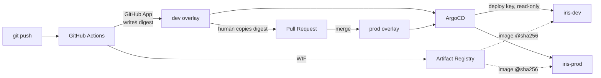
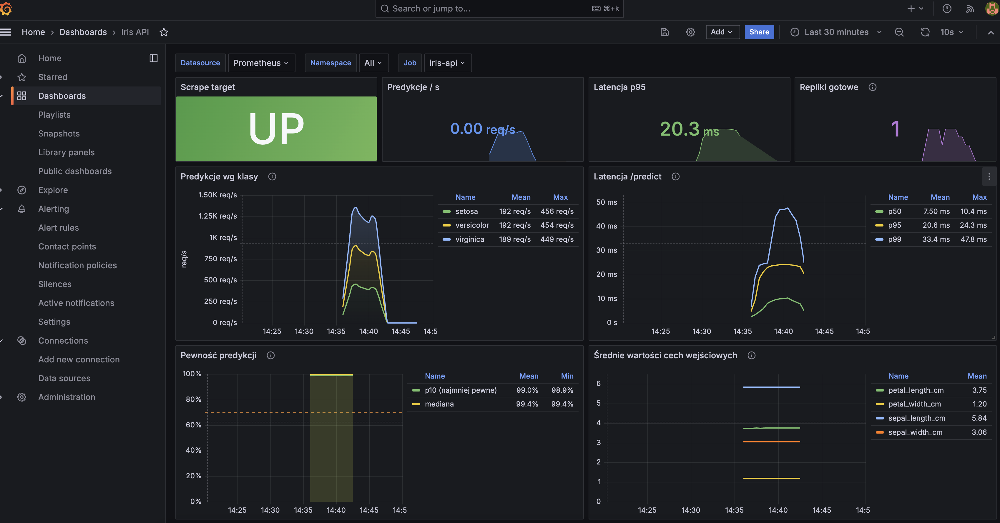

# Iris MLOps — End-to-End GitOps on GKE

A PyTorch classifier deployed to Google Kubernetes Engine through ArgoCD, with no
static credentials anywhere in the pipeline, images pinned by digest rather than
tag, and promotion from `dev` to `prod` gated behind a pull request.

The model itself is deliberately trivial — a three-layer MLP on the Iris dataset.
Everything interesting is in the delivery path around it.

---

## Stack

PyTorch · FastAPI · Docker · Kubernetes (GKE, KIND) · ArgoCD · Kustomize ·
Terraform · GitHub Actions · Workload Identity Federation · Prometheus · Grafana ·
k6 · uv

---

## Architecture



The upper path is automatic: every push to `main` produces an image and a digest
committed into the `dev` overlay. The lower path is not: reaching `prod` requires
a person to copy that digest across in a pull request.

Three separate repositories, not one. The split follows blast radius: CI can push
images but cannot touch the cluster; ArgoCD can read config but cannot write it;
Terraform state lives away from both. In this portfolio they appear as `app/`,
`config/` and `infra/` subdirectories for readability.

---

## Three identities, zero long-lived keys

Every authentication hop in the pipeline uses a credential that expires on its own,
scoped to exactly one job.

| Hop | Mechanism | Lifetime | Scope |
|---|---|---|---|
| CI → Google Cloud | Workload Identity Federation | minutes | `artifactregistry.writer` only |
| CI → GitHub (config repo) | GitHub App installation token | 1 hour | one repo, contents only |
| ArgoCD → GitHub | SSH deploy key | n/a | one repo, read-only |

Three separate problems that all have the same wrong answer — paste a long-lived
token somewhere — and three different right answers.

A few consequences worth stating plainly:

- **CI has no cluster access at all.** It pushes an image and writes a digest into
  the config repo. Whether that digest ever reaches a cluster is ArgoCD's business.
- **CI cannot train the model.** The CI service account has no GCS permissions.
  Training runs manually under a separate identity. This is a deliberate boundary,
  not an unfinished feature.
- **`GITHUB_TOKEN` is only valid inside its own repository.** Cross-repo pushes
  return 403, which is why the GitHub App exists at all.
- **ArgoCD originally used a personal OAuth token** obtained from `gh auth token`.
  That put a long-lived, all-repos, write-capable credential inside the cluster.
  Replacing it with a read-only deploy key scoped to one repository was one of the
  more valuable ten-minute changes in the project.

---

## What gets deployed is what was tested

The CI pipeline writes an image **digest**, not a tag, into the Kustomize overlay:

```yaml
images:
  - name: iris-api-placeholder
    newName: europe-central2-docker.pkg.dev/PROJECT_ID/iris/api
    digest: sha256:e98dd6db5e55900c89d18486656564d6d344f88a9fd7b0e8062c6b1f9235fe7d
```

A tag is a mutable pointer. A digest is the image. Tags are still pushed
(`sha-<short>`) purely so the Cloud console is readable by humans.

This has a pleasing verification property: the same digest deployed to `dev` and
to `prod` returns predictions identical to the last decimal place —
`confidence: 0.9999635219573975` in both namespaces, and on the local KIND cluster
too. When those numbers diverge, something in the supply chain moved.

The model itself is *not* baked into the image. It is fetched from GCS at pod
startup via Workload Identity, which keeps the image generic across model versions
and makes retraining a data-plane operation rather than a rebuild. Measured cost
of that choice on GKE: **1.6 seconds** at pod start — considerably cheaper than the
60–90 seconds originally assumed, because the real scale-up cost is pulling the
image onto a node that lacks it in its containerd cache.

The same code path (`storage.py`) handles `file://`, real `gs://`, and a
`fake-gcs-server` emulator, so the local KIND environment exercises the production
code rather than a stub of it.

---

## Promotion is a pull request

`dev` and `prod` are separate Kustomize overlays over a shared base. CI writes new
digests into `dev` automatically, committing straight to `main`. Nothing writes
into `prod` automatically.

Promotion is a human copying one digest from the `dev` overlay to the `prod`
overlay, in a branch, as a pull request:

```bash
DIGEST=$(kustomize build overlays/dev \
  | yq '.spec.template.spec.containers[0].image' \
  | grep -o 'sha256:[a-f0-9]*')

git switch -c "promote/dev-to-prod-${DIGEST:7:7}"
yq -i ".images[0].digest = \"$DIGEST\"" overlays/prod/kustomization.yaml
git diff overlays/prod/kustomization.yaml   # exactly one line should change
```

The pull request is the gate — not the ArgoCD sync policy, which stays fully
automated on both environments. This puts the human decision at the point where a
human decision actually adds information ("should this specific, already-tested
build go to production?") rather than on every commit, where it degrades into
rubber-stamping.

---

## The autoscaler versus the GitOps controller

Git says `replicas: 1`. The HPA scales to 5 under load. ArgoCD sees drift and
scales it back to 1. The application is now fighting its own control plane.

```yaml
ignoreDifferences:
  - group: apps
    kind: Deployment
    jsonPointers: [/spec/replicas]
```

The subtlety worth understanding: `ignoreDifferences` changes what ArgoCD *reports*
as drift, not what it *sends* during a sync. So the HPA scales freely (no drift
reported, no sync triggered), while a manual `kubectl scale` still triggers a sync
and still gets reverted. Both properties are the ones you want, and they coexist
without contradiction.

The same pathology exists one floor down in Terraform: a node pool declared with
`node_count` next to an `autoscaling` block produces phantom drift on every
`terraform plan` as the cluster autoscaler does its job. The fix is
`initial_node_count`, and the underlying lesson is identical — declare the initial
state, not the running state, for anything a controller manages.

---

## Measurements, including the ones without answers

Load tested with k6 for 5m30s, feature vectors sampled from the three Iris class
distributions so the predicted-class mix stays even and the drift dashboard gets a
baseline.

| Metric | KIND (laptop) | GKE `dev` |
|---|---|---|
| Requests | 425,130 | 273,563 |
| Throughput | ~1290 rps | ~829 rps |
| Errors | 0.02% | **0.00%** |
| p50 latency | 26.2 ms | 29.3 ms |
| p95 latency | 50.2 ms | **109.4 ms** |
| p95/p50 | 1.9 | **3.7** |
| HPA scale-up | 1→3→5 | 1→3→5 |

**GKE is slower than a laptop under identical configuration, and I do not know
why.** Candidates, in the order I would investigate them: on KIND the load
generator and the API share a host and traffic never leaves the loopback, while on
GKE every request crosses the VPC and possibly hops between nodes; the `e2` machine
profile has variable vCPU performance because it is shared, unlike `n2`. A
p95/p50 ratio of 3.7 is a long tail with a real cause, and the cause is not the
autoscaler — it reached `maxReplicas` and stayed there.

The zero-error result on GKE is an improvement over KIND, where 0.02% of requests
failed on connections dropped during scale-down. That was addressed afterwards with
`preStop: sleep 5` and a 30-second termination grace period — the race is between
Endpoints propagation and SIGTERM reaching the container, and the sleep buys the
former enough time to win.

Load tests are run manually with `kubectl apply -k`, deliberately outside ArgoCD.
Managed as an `Application` with an automated sync policy, ArgoCD would recreate
the Job every time it completed, and the test would run forever.

---

## Observability, and one dashboard design decision

`kube-prometheus-stack` is installed by ArgoCD as a Helm-type `Application` rather
than by hand, so the monitoring stack lives under the same GitOps rules as
everything else. The Grafana dashboard is a JSON file in the repo, picked up by the
sidecar through a labelled ConfigMap; the content hash in the ConfigMap name is
left enabled so that editing the dashboard produces a new name, the sidecar
notices, and ArgoCD prunes the old one.

The application exposes four domain metrics beyond the usual latency histograms:
prediction counts by class, confidence distribution, per-feature value
distributions, and prediction latency.



The confidence panel plots the **10th percentile, not the mean**. Setosa is
linearly separable from the other two classes and returns ~0.9999 essentially
always, which drags any average up to a flat, uninformative line. The lower
quantile is where versicolor/virginica ambiguity actually shows up. Choosing the
right statistic mattered more than adding more panels.

Prometheus runs with a 10Gi PVC on GKE and `emptyDir` on KIND. On spot nodes the
Prometheus pod can be evicted mid-experiment, and losing the metric history for a
load test that just ran is a bad way to learn about storage classes.

---

## Failure drill

Reverting a deployment through Git, and confirming that the revert reaches the
cluster, is a procedure worth testing before it is needed:

```bash
git revert <sha> --no-edit
git show --stat HEAD    # confirm what is being undone, before opening the PR
```

Merging the revert produced `PodDisruptionBudget ... Succeeded / Pruned` in the
ArgoCD sync events, and `kubectl get pdb` returned `NotFound` in both namespaces.
That is the practical difference between having `prune: true` in a sync policy and
knowing that it removes resources rather than merely leaving them behind.

---

## A note on spot nodes

The cluster runs on preemptible nodes, which is a deliberate cost trade with a
sharp edge: a preemption during a load test invalidates the results, and it does
not announce itself. The observed failure chain was:

```
Google reclaims the machine
  → node controller applies a taint
  → TaintManagerEviction moves the pods
  → the port-forward dies
  → argocd CLI reports "Invalid username or password"
```

Five layers between cause and symptom, and the final message points at
authentication. Settled in three seconds by asking the right system:

```bash
gcloud compute operations list --filter='operationType~preempt' --zones="$ZONE"
```

`Listed 0 items` means the load-test numbers describe the application. Every
measurement in the table above was checked this way.

A `PodDisruptionBudget` does not help here, and it is worth being precise about
why: PDBs constrain *voluntary* disruptions that go through the Eviction API —
drains, node upgrades. A spot preemption is involuntary. The machine leaves whether
Kubernetes agrees or not.

---

## Repository layout

| Directory |  Contents |
|---|---|
| `app/` |  PyTorch model, FastAPI service, Dockerfiles, GitHub Actions CI |
| `config/` | Kustomize base and three overlays, ArgoCD Applications, KIND setup, k6 load tests |
| `infra/` | Terraform: VPC, GKE, Artifact Registry, GCS, service accounts, WIF |

Project identifiers have been replaced with placeholders (`PROJECT_ID`,
`PROJECT_NUMBER`). `terraform.tfvars` is not included; see
`terraform.tfvars.example`.
