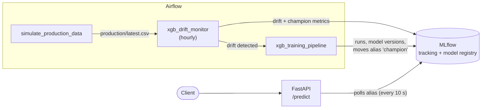
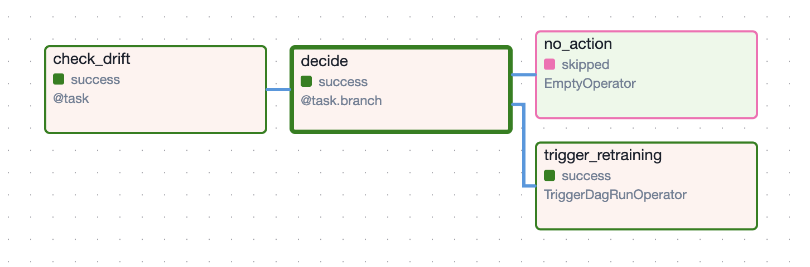
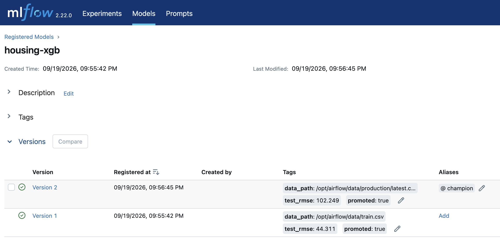

# End-to-End MLOps Demo: XGBoost · Airflow · MLflow · FastAPI

A fully local, reproducible demo of the **machine-learning model lifecycle**: training with hyperparameter search, experiment tracking, a model registry with **champion/challenger promotion**, alias-based serving with **zero-downtime model swaps**, **drift monitoring**, and **automated retraining**, all orchestrated by `Airflow` and started with one command.

The point is not the model (a gradient-boosted regressor on synthetic housing prices) but the **system around it**: what happens after `model.fit()`, when the world changes and the model quietly gets worse.


## What it demonstrates

- **Orchestration**: three Airflow DAGs (TaskFlow API) with parameters, branching and cross-DAG triggering.
- **Experiment tracking**: `random search` where every trial is a nested MLflow run (params, metrics, model artifact).
- **Model registry & safe promotion**: a new model replaces the current `champion` only if it beats it by a configurable margin on the *same* held-out test set.
- **Decoupled serving**: the API loads `models:/housing-xgb@champion`. Promoting a model is a registry operation, so **no redeploy or restart** is needed.
- **Monitoring**: per-feature drift (KS test + PSI) *and* champion quality on labelled production data, logged to MLflow.
- **Closed loop**: drift detected → retraining triggered → challenger evaluated → alias moved → drift reference reset.
- **Engineering hygiene**: pinned and constraint-checked dependencies, configurable ports, one-command startup.

## Architecture



Airflow and the API **never talk to each other**. They communicate only through the MLflow registry: Airflow moves the `champion` alias, the API notices it and reloads the model.

### Pipelines

| DAG | Purpose |
|---|---|
| `xgb_training_pipeline` | `prepare_data → train → register → evaluate_and_promote → update_reference`. Random search (default 8 trials, early stopping), registers the best model, runs the champion/challenger gate, and refreshes the drift reference if the challenger won. |
| `simulate_production_data` | Writes labelled "production" data with a tunable `drift` level (0 = none, 1 = strong) so the whole scenario can be driven from the UI. |
| `xgb_drift_monitor` | Compares production data with the reference, evaluates the champion on it, logs metrics and a JSON report, and **branches**: trigger retraining if the share of drifted features passes the threshold, otherwise do nothing. |

## Tech stack

| Layer | Tools |
|---|---|
| Model | XGBoost 2.1, scikit-learn |
| Orchestration | Apache Airflow 2.10 (LocalExecutor, Postgres metadata DB) |
| Tracking & registry | MLflow 2.22 (SQLite backend, artifact proxy) |
| Serving | FastAPI, Pydantic, Uvicorn |
| Infrastructure | Docker Compose |

## Quickstart

**Prerequisites:** Docker with Compose v2 and roughly 4 GB of free RAM.

```bash
cp .env.example .env        # optional: change host ports
docker compose up --build -d
```

The first build takes a few minutes. Then open:

| Service | URL | Notes |
|---|---|---|
| Airflow | http://localhost:8080 | login `admin` / `admin` (demo only) |
| MLflow | http://localhost:5000 | |
| API docs | http://localhost:8000/docs | |

> **macOS:** port 5000 is taken by AirPlay Receiver. Set `MLFLOW_PORT=5001` in `.env` (or disable AirPlay Receiver in System Settings). Host ports for all three services are configurable in `.env`; container-internal ports never change.

Useful commands: `docker compose ps`, `docker compose logs -f`, `docker compose down`, and `docker compose down -v` (also deletes all data).

## Demo walkthrough

Trigger DAGs in the Airflow UI (▶ → *Trigger DAG w/ config*) and wait for each DAG to finish before the next step.

| # | Action | What to look for |
|---|---|---|
| 1 | Run `xgb_training_pipeline` | All 5 tasks green. MLflow → *Models* → `housing-xgb` has **v1 with alias `champion`**. |
| 2 | Call the API (request below) | `{"model_version": "1", "predictions_kpln": [~698]}` |
| 3 | Run `simulate_production_data` with `drift = 0`, then `xgb_drift_monitor` | Branch `no_action`. `drift_share=0.00`, champion RMSE ≈ 41–46. |
| 4 | Run `simulate_production_data` with `drift = 0.8`, then `xgb_drift_monitor` | 4 of 6 features flagged, champion RMSE jumps to ≈ 590, branch `trigger_retraining`, and `xgb_training_pipeline` starts by itself. |
| 5 | Wait for the training run, then call the API again (within ~10 s) | `model_version` is now **2** and the price for the same flat changes (≈ 990 k PLN). **The API was never restarted.** |
| 6 | Run `xgb_drift_monitor` again | `no_action`: the reference now matches the new champion's data, so the loop is closed. |

Request used in steps 2 and 5:

```bash
curl -s localhost:8000/predict -H 'Content-Type: application/json' -d '{
  "instances": [{"area_m2": 55, "rooms": 2, "age_years": 15,
                 "distance_center_km": 4.5, "floor": 3, "has_balcony": 1}]}'
```

### Typical numbers (from local runs; yours will differ slightly)

| Situation | Champion RMSE (k PLN) | R² |
|---|---|---|
| Baseline, held-out test set | ≈ 41–46 | ≈ 0.97 |
| Same champion on drifted production data | ≈ 590 | < 0 |
| Retrained champion on drifted data | ≈ 80–100 | ≈ 0.98 |

The synthetic data generator injects both **data drift** (larger, newer flats closer to the centre) and **concept drift** (higher price per m² and a stronger city-centre premium). Per-feature statistical tests catch the first; the jump in RMSE reveals the second.


## Screenshots

**Drift detected → retraining triggered** (Airflow, `xgb_drift_monitor`)



**Model registry: v2 promoted to `champion`** (MLflow)



Model v1 was trained on baseline data; v2 was trained on drifted production data and took over the `champion` alias. The `test_rmse` tags come from each model's own test set, so they are not directly comparable. The promotion gate compared both on the same drifted test set.

## Key design decisions

- **Alias-based serving.** The API asks the registry "what is `champion` right now?" instead of pinning a version. Rollback is one `set_registered_model_alias` call. The check is lazy (on request, at most every `REFRESH_SECONDS`), so no background thread is needed, and a concrete version (not the alias) is loaded to avoid a race if the alias moves mid-load.
- **Champion/challenger gate.** The challenger is promoted only if its RMSE is at least 2% lower than the champion's RMSE on the same test split of the new data. Retraining on identical data produces an identical model that is *rejected*, which prevents alias flapping.
- **Two-criteria drift flag.** A feature counts as drifted only if the KS p-value < 0.01 *and* PSI ≥ 0.1. With large samples KS alone flags statistically significant but practically meaningless differences.
- **Custom KS/PSI instead of Evidently.** Fewer dependencies and no version conflicts with Airflow's pinned constraints. Swapping in Evidently touches only `compute_drift`.
- **Orchestration is separated from logic.** DAGs only wire tasks together. All ML code lives in `src/mlops_demo/` with no Airflow imports, so it can be imported and run without Airflow. Heavy imports (`xgboost`, `mlflow`) happen inside tasks, keeping DAG parsing fast.
- **Reproducible and dependency-safe.** Seeds are fixed, versions are pinned (MLflow client and server both 2.22), and the Airflow image installs ML libraries against Airflow's official constraints file. Without it, pip pulls a `protobuf` version that conflicts with Airflow's own packages.
- **Synthetic data on purpose.** Works offline and lets you dial drift up and down deterministically.

## Project structure

```
├── dags/                       Airflow DAGs (orchestration only)
│   ├── xgb_training_pipeline.py
│   ├── xgb_drift_monitor.py
│   └── simulate_production_data.py
├── src/mlops_demo/             ML logic, framework-agnostic
│   ├── config.py               paths, MLflow names (dependency-free)
│   ├── data.py                 synthetic data generator with drift knob
│   ├── training.py             random search, registration, promotion gate
│   └── drift.py                KS + PSI drift detection
├── api/                        FastAPI service (own image)
├── airflow/  mlflow/           Dockerfiles
├── .env.example                host port overrides
└── docker-compose.yaml
```

## Configuration

| What | Where |
|---|---|
| Host ports | `.env` (`AIRFLOW_PORT`, `MLFLOW_PORT`, `API_PORT`) |
| Trials, promotion margin, data path | Airflow trigger form for `xgb_training_pipeline` (`n_trials`, `min_improvement`, `data_path`) |
| Drift thresholds | Airflow trigger form for `xgb_drift_monitor` (`alpha`, `drift_share_threshold`) |
| Search space | `_sample_params` in `src/mlops_demo/training.py` |
| Model refresh interval | `REFRESH_SECONDS` in `docker-compose.yaml` (API service) |
